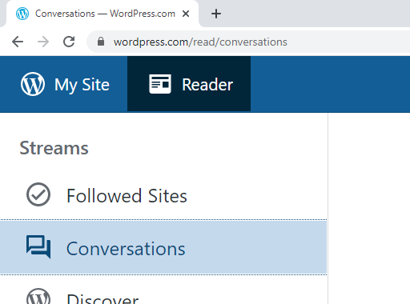
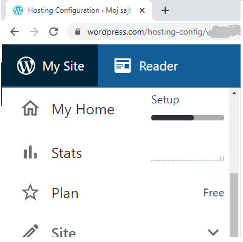
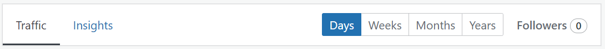

Основне компоненте система WordPress
====================================

Након регистрације и логовања на веб-сајт `<WordPress.com>`_ могу се користити две основне услуге.

Услуга названа *Reader* (читалац) је нека врста часописа који корисник може да прилагоди својим интересовањима. Основна могућност која се нуди је избор сајтова које корисник жели да прати, тако да се објаве са тих сајтова појављују у часопису корисника. Ту су и уобичајене пратеће могућности, као што је лајковање и коментарисање објава. Могуће је водити и пратити разговоре о објавама, а корисник има и преглед разговора који га интересују. Поред тога, корисник може једноставно да креира своје кратке објаве, које ће видети други корисници.

Услуга названа *My Site* или *My Sites* (мој сајт, или моји сајтови, зависно од броја направљених сајтова) даје могућност кориснику да управља блоговима и веб-сајтовима. Како је тема овог курса креирање веб сајтова, ставкама менија *My Site* ћемо се позабавити детаљније.

Ставке у менију *My Site* нас воде ка различитим секцијама, повезаним са развијањем сајта.
 
**Секција Stats** омогућава праћење бројних статистичких података који се односе на веб-сајт. 

Преко ставке *Traffic* помоћног менија корисник може да прати број прегледа (*views*) и број посетилаца (*visitors*), било по данима, недељама, месецима или годинама. Посебно су издвојене статистике за последњи дан, а може се пратити колико посетилаца долази из које земље, број кликова приликом посета и разни други подаци.

Кликом на ставку *Insights* (увиди) помоћног менија, корисник може да види колико је био активан у појединим периодима - у врло прегледном графичком приказу поједини дани у календару су осенчени различитим нијансама према броју објава (постова).

Присутни су и разни други подаци, као што је статистика последње објаве (број прегледа, лајкова и коментара), статистика пратилаца (колико их је дошло преко сајта *WordPress.com*, е-поште, друштвених мрежа), најпопуларнији дан и сат (којим даном је било највише посета, у којем сату има највише посета) и слично.

**Секција Plan** нуди пакете услуга које корисник може да одабере. Поред бесплатног плана, који нуди најскромније могућности, у оквиру различитих пакета (планова), корисник може за одређену своту новца да добије разне повољности као што је подршка уживо, сопствени домен, више меморије за складиштење делова сајта, додатне теме за уређивање изгледа сајта, уклањање огласа компаније *WordPress.com* и слично.

**Секција Site** даје преглед садржаја додатих на сајт (странице, објаве, мултимедијални садржаји - слике, видео), а нуди и могућност додавања нових садржаја. Ову секцију ћемо ускоро описати детаљније.

**Секција Jetpack** (млазни ранац) омогућава детаљан преглед историје промена начињених на сајту. За плаћене планове може се пратити дужа историја, а промене се могу филтрирати како би се лакше пронашла тражена. Поред тога, у оквиру плаћеног плана могуће је памћење појединих стања (*backup*), што је корисно у ситуацији када нисмо задовољни последњим променама сајта и желимо да се вратимо на неко од претходних стања.

**Секција Design** има подсекције **Customize** и **Themes**. Избором опције **Customize** прелази се у посебан модул (*customizer*, прилагођавач), у коме се могу подешавати изглед и фукционалност сајта. Из овог модула се могу мењати елементи страна, укључујући и наслов, позадинску слику и меније. Избором опције **Themes** отвара се галерија понуђених тема, које дефинишу изглед и начин приказивања веб страница, односно дају страницама визуелни иднтитет. Темом се најчешће задаје комбинација боја које се користе на сајту, фонтови, распоред елемената и слично. Тема сајта се може једноставно променити у било ком тренутку - потребно је изабрати тему кликом и потврдити избор притиском на дугме *Actviate this design*.

**Секција Tools** нуди разне алате у виду прикључака за *WordPress* (*plugins*), помоћу којих се сајту корисника може лако додавати одређена специфична функционалност (у зависности од изабраног прикључка). Тако је на пример, могуће инсталирати прикључак који оптимизује сајт за боље рангирање од стране претраживача (*search engine optimization*, скраћено *SEO*), прикључак који омогућава посетиоцима сајта да направе своје профиле на сајту и постану регистровани посетиоци, прикључак за комуникацију са аутором сајта (додавањем одгвоарајућег интерфејса на некој од страница сајта), прикључак за аутоматско прављење резервних копија веб-сајта, као и прикључци за многе друге намене. Прикључке није могуће користити у оквиру бесплатног плана.

Кроз секцију *Tools* је поред инсталирања прикључака могуће увозити сопствене садржаје хостоване на другим платформама, пребацити поједине садржаје на свој рачунар и сл. Ове могућности могу да буду згодне нпр. ако премештамо сајт на други веб сервер.

**Секција Manage** садржи разне могућности, као што су мењање адресе креираног сајта, слање позивница другим особама, било као посетиоцима сајта, било као сарадницима у изради), приступ бази података сајта (само за плаћене планове) и друге.

**Секција WP Admin** отвара контролну таблу (*WP admin panel* или *Dashboard*). Преко контролне табле корисник може са једног места да види све информације о сајту, као и да додаје, мења или брише поједине елементе. Администраторима су доступни сви делови у овој области, док су права приступа особама са другачијим ролама, тј. улогама (аутор, уредник, сарадник) мање или више ограничена.

