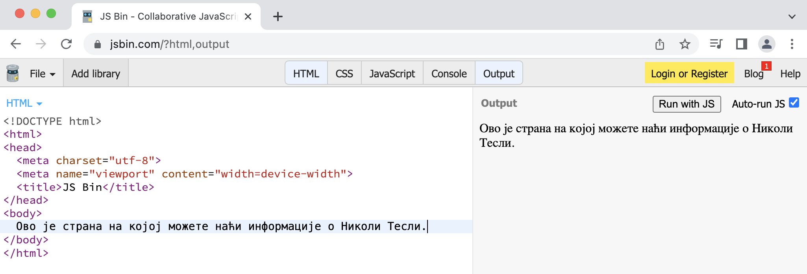

Приказивање *HTML* документа
============================

*HTML* документи су текстуални фајлови написани на језику *HTML*, који разуме сваки прегледач (*Chrome*, *Microsoft Internet Explorer*, *FireFox*, *Microsoft Edge* и други). Прегледач који добије неки *HTML* документ може да прикаже информације које су у њему.

Текстуалне фајлове који чине *HTML* документе можете да напишете у било ком едитору текста као што је *Notepad*. *HTML* је језик за означавање (енгл. *Markup Language*) и служи да опише особине, структуру и садржај веб-стране. Пример једноставног *HTML* документа је приказан у следећем листингу:

.. code-block:: html

    <!doctype html>
    <html>
        <head>
            <meta charset="utf-8"/>
            <title>Никола Тесла</title>
        </head>
        <body>
            Ово је страна на којој можете наћи информације о Николи Тесли.
        </body>
    </html>

Делови документа између ознака ``<title>`` и ``</title>``, као и између ознака ``<body>`` и ``</body>`` представљају садржај стране, који ће у сваком конкретном случају бити друкчији, а остатак је структура коју ћете користити на свакој страни коју направите.

Ако овакав текст напишете у било ком текстуалном документу и сачувате као фајл са екстензијом .html (на пример ``c:\temp\nikolatesla.html``), моћи ћете да га отворите помоћу прегледача као што је *Chrome*. Пример како би се приказао овај фајл у прегледачу *Chrome* је приказан на следећој слици:

Име између ознака ``<title>`` и ``</title>`` у *HTML* документу из претходног примера је приказано као наслов веб-стране у прегледачу. Текст између ознака ``<body>`` и ``</body>`` је приказан као садржај стране.

Један начин да видите *HTML* документ у веб-прегледачу као веб-страну је да сачувате документ на свом рачунару, као што смо управо урадили. Други начин је да користимо неки од веб-сајтова који нам омогућавају да директно у прегледачу унесемо HTML документ и видимо како би документ изгледао. На пример, један користан сајт је `JSBin <https://jsbin.com/?html,output>`_. Ако отворите ову веб-страну и унесете *HTML* документ у *HTML* поље, одмах ћете видети резултат са десне стране:

    
Постоје и други сајтови који нам омогућавају да унесемо *HTML* текст и који ће нам приказати како ће страна изгледати. Такви сајтови су, на пример `HTML Fiddle <https://htmlfiddle.net>`_ или `JSFiddle <https://jsfiddle.net>`_. Копирајте дати *HTML* текст у ове сајтове како бисте видели како приказују резултат и одаберите онај који ћете користити када желите да експериментишете са садржајем веб-стране.

У овом курсу ћете повремено наилазити на овако приказан *HTML* кôд:

.. petlja-editor:: aktivan_kod_html

    index.html
    <!doctype html>
    <html>
        <head>
            <meta charset="utf-8"/>
            <title>Никола Тесла</title>
        </head>
        <body>
            Ово је страна на којој можете наћи информације о Николи Тесли.
        </body>
    </html>

У том случају, кликом на дугме „Result“ можете у оквиру странице курса да видите како би одговарајућа веб-страна изгледала, када би била отворена у прегледачу као независан документ. У примерима на курсу се садржај између ознака ``<title>`` не приказује ``</title>``.

Направили смо нашу прву веб-страну! Она за сада нема неки нарочит садржај, структуру и изглед, али у следећим лекцијама ћемо научити како да форматирамо и дизајнирамо садржај стране, а не само да стављамо једноставан текст.
