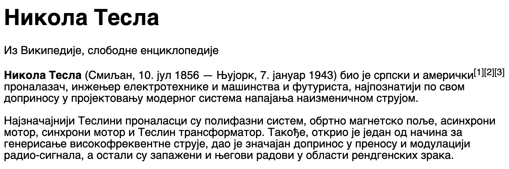

Форматирање текста
==================

*HTML* језик садржи елементе којима можемо да опишемо структуру текста. Сваки текстуални документ има делове који имају нека значења (наслови, пасуси текста, табеле, листе). На следећој слици је приказан пример текста о Николи Тесли који је (у августу 2022. године) преузет са сајта *Википедија*:

|

У тексту можемо да приметимо следеће елементе:

- Наслов **Никола Тесла**, који је подебљан и већи од остатка текста.
- Три пасуса текста испод наслова.
- Име Никола Тесла, којим почиње други пасус, подебљано је (енгл. *bold*).
- Референце :math:`~^{[1][2][3]}` су мaње од остатка текста и мало уздигнуте (енгл. *superscript*).

У језику *HTML* се могу означити делови текста који представљају наслове, пасусе, подебљани или издигнути текст, тако што се ови делови ставе у одговарајуће HTML елементе. На пример, прво помињање Николе Тесле у тексту је наслов, па ће оно бити стављено у ``<h1>`` елемент. Сваки пасус текста ће бити стављен у по један ``
`` елемент. На овај начин ће прегледач знати који делови документа представљају различите целине и које врсте је која целина у тексту. Пример са слике представљен језиком *HTML* би изгледао овако:

.. petlja-editor:: nikola_tesla_html

    index.html
    <!doctype html>
    <html>
        <body>
            <h1>Никола Тесла</h1>
            
Из Википедије, слободне енциклопедије

            
<b>Никола Тесла</b> (Смиљан, 10. јул 1856 — Њујорк, 7. јануар 1943)
            био је српски и амерички[1][2][3] проналазач, инжењер
            електротехнике и машинства и футуриста, најпознатији по свом доприносу
            у пројектовању модерног система напајања наизменичном струјом.

            
Најзначајнији Теслини проналасци су полифазни систем, обртно
            магнетско поље, асинхрони мотор, синхрони мотор и Теслин трансформатор.
            Такође, открио је један од начина за генерисање високофреквентне струје,
            дао је значајан допринос у преносу и модулацији радио-сигнала, а остали су запажени и његови радови у области рендгенских зрака.

        </body>
    </html>

Ако упоредите овај текст са сликом, можете приметити да су сви специјални делови текста означени и стављени у одговарајуће *HTML* елементе.

У *HTML* језику постоји велики број ознака којима можете окружити текст и тако му дати специјално значење.

.. table:: Основни елементи за форматирање текста

    =========================== ======================== ====================
    Елемент                     Таг                      Назив на енглеском
    =========================== ======================== ====================
    Пасуси текста               ``p``                    Paragraph
    Поднаслови различитих нивоа ``h1``, ``h2``, … ``h6`` Heading
    Подебљан текст              ``b``                    Bold
    Искошен текст               ``i``                    Italic
    Подвучен текст              ``u``                    Underline
    Подигнут текст              ``sup``                  Superscript
    Спуштен текст               ``sub``                  Subscript
    =========================== ======================== ====================

Осим поменутих, постоји велики број додатних тагова о којима можете научити више на `W3 schools сајту <https://www.w3schools.com/tags/default.asp>`_.

