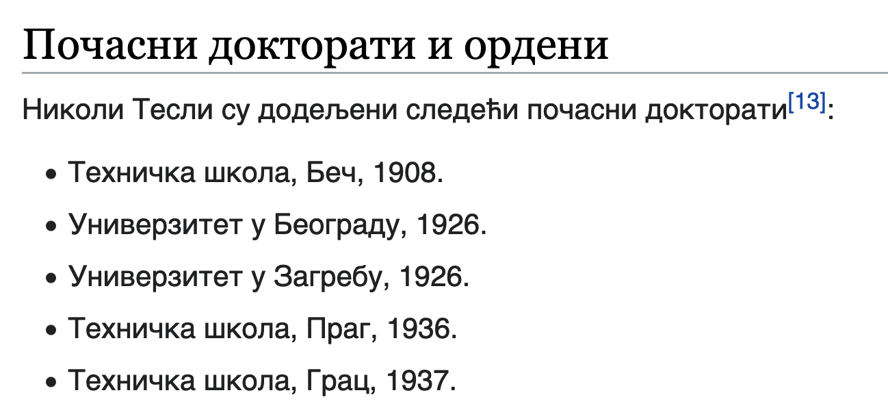

Листе
=====

Текст нису само наслови и пасуси. У великом броју случајева потребно је додати и неке листе у текст. У овој лекцији ћете научити како се користе *HTML* елементи који представљају сложеније текстуалне структуре попут листи.

У овом случају, **листа** представља низ кратких текстова, који се приказују један испод другог. Листе се користе при набрајању, задавању неких корака и слично. Погледајмо као пример следећи текст о почасним докторатима које је добио Никола Тесла (преузето са сајта Википедија):

|

Докторати које је Никола Тесла добио су кратки текстуални записи које желимо да набројимо у виду листе. Свака ставка у листи се представља елементом ``<li>`` (енгл. *list item*), овако:

.. code-block:: html

    <li>Техничка школа, Беч, 1908.</li>
    
Сви елементи листе се стављају у посебан *HTML* елемент који означава листу као целину. У *HTML* језику се за представљање целе листе најчешће користи један од ова два елемента:

- ``<ul>`` елемент, који представља неуређену листу (енгл. *unordered list*), у којој се елементи приказују без индексирања. Садржај у оваквим листама се окружује ``<ul>`` и ``</ul>`` ознакама.
- ``<ol>`` елемент, који представља уређену, односно нумерисану листу (енгл. *ordered list*), у којој се елементи листе приказују у неком редоследу, обележени словима (а, б, ц) или редним бројевима (1, 2, 3). Садржај у овим листама се окружује ``<оl>`` и ``</оl>`` ознакама.

Имајући у виду ова правила, листа са слике би могла да буде задата помоћу *HTML* кôда овако:

.. petlja-editor:: lista_doktorati_ul

    index.html
    <!doctype html>
    <html>
      <body>
        <ul>
          <li>Техничка школа, Беч, 1908.</li>
          <li>Универзитет у Београду, 1926.</li>
          <li>Универзитет у Загребу, 1926.</li>
          <li>Техничка школа, Праг, 1936.</li>
          <li>Универзитет у Греноблу, 1938.</li>
        </ul>
      </body>
    </html>

У случају да је потребна нумерисана листа (енгл. *ordered list*), користили бисмо ознаке ``<ol>`` и ``</ol>`` уместо ``<ul>`` и ``</ul>``, а ставке у листи би и даље биле окружене ``<li>`` и ``</li>`` ознакама. Исту листу дакле можемо представити као листу са бројевима:

.. petlja-editor:: lista_doktorati_ol

    index.html
    <!doctype html>
    <html>
      <body>
        <ol>
          <li>Техничка школа, Беч, 1908.</li>
          <li>Универзитет у Београду, 1926.</li>
          <li>Универзитет у Загребу, 1926.</li>
          <li>Техничка школа, Праг, 1936.</li>
          <li>Универзитет у Греноблу, 1938.</li>
        </ol>
      </body>
    </html>

Нумерисаној листи је могуће проследити атрибуте ``start`` и ``type``. Атрибут ``start`` описује од ког редног броја почиње нумерација, док је атрибутом ``type`` могуће променити тип нумерисања, на пример, нумерисати словима или римским бројевима.

Као атрибут ``type`` могуће је проследити:

* ``1`` за нумерацију арапским бројевима,
* ``i`` за нумерацију римским бројевима (мала слова),
* ``I`` за нумерацију римским бројевима (велика слова),
* ``a`` за нумерацију словима (мала слова),
* ``A`` за нумерацију словима (велика слова).

Пример доктората са нумерисаном листом малим словима која почиње од трећег слова дат је следећим кôдом:

.. petlja-editor:: lista_doktorati_ol_type

    index.html
    <!doctype html>
    <html>
      <body>
        <ol start="3" type="a">
          <li>Техничка школа, Беч, 1908.</li>
          <li>Универзитет у Београду, 1926.</li>
          <li>Универзитет у Загребу, 1926.</li>
          <li>Техничка школа, Праг, 1936.</li>
          <li>Универзитет у Греноблу, 1938.</li>
        </ol>
      </body>
    </html>

.. questionnote::

    **Вежба**

    У претходном примеру испробајте различите комбинације атрибута ``start`` и ``type``.

Угњеждене листе
---------------

Уређене и неуређене листе је могуће угњеждавати како би добили поднивое. Унутар елемента ``li`` као садржај је, поред текста, могуће додати посебну листу.

Следећи пример показује листу са насловом „Садржај“, која има ставке „Биографија“ и „Средње године“. Ставке имају угњеждене листе које могу бити другачијег типа, на пример, ставка „Средње године“ има угњеждену листу нумерисану малим словима.

.. petlja-editor:: ugnjezdena_lista_html

    index.html
    <!doctype html>
    <html>
      <body>
        <h1>Садржај</h1>
        <ol>
          <li>Биографија
            <ol type="1">
              <li>Школовање</li>
              <li>Студије</li>
              <li>...</li>
            </ol>
          </li>
          <li>Средње године
            <ol type="a">
              <li>Први патенти из наизменичних струја</li>
              <li>Експерименти са икс зрацима</li>
              <li>...</li>
            </ol>
          </li>
          <li>...</li>
        </ol>
      </body>
    </html>
