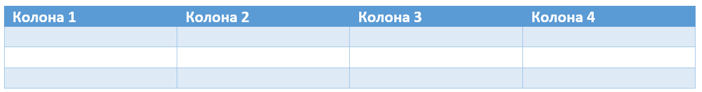

Табеле
======

Поред обичног текста и листи, у веб-стране често додајемо и табеле. Сада ћемо научити како то може да се уради и који *HTML* елементи се користе за то.

**Табеле** представљају податке организоване у облику редова и колона.

Први ред у табели садржи називе колона и назива се **заглавље** (енгл. *heading*) табеле. Испод овог реда се налазе редови који садрже податке у својим **ћелијама** (енгл. *cells*).

Табела је сложени *HTML* елемент, који садржи више других елемената различитих врста. *HTML* елементи садржани у табели представљају различите делове табеле (заглавље, остали редови, ћелије).

.. table:: Елементи табела

    =============  =======================  ==============
    Елемент        Опис                     Енглески назив
    =============  =======================  ==============
    ``<table>``    Табела                   Table
    ``<thead>``    Заглавље табеле          Table header
    ``<tbody>``    Тело табеле              Table body
    ``<tr>``       Ред табеле               Table row
    ``<th>``       Ћелија заглавља табеле   Table heading
    ``<td>``       Ћелија тела табеле       Table data
    ``<tfoot>``    Подножје табеле          Table footer
    ``<caption>``  Поднаслов                Caption
    =============  =======================  ==============

Цела табела је окружена тагом ``<table>``. Унутар сваке табеле се налази заглавље (елемент ``<thead>``) и **тело** (елемент ``<tbody>``). Унутар заглавља и тела се налазе **редови**.

.. code-block:: html
   :caption: Табела са заглављем и телом:

    <table>
        <thead>
            ...
        </thead>
        <tbody>
            ...
        </tbody>
    </table>

Ред се описује елементом ``<tr>`` и у њему се налазе ћелије колона табеле.

Унутар заглавља табеле, ћелије табеле су окружене елементом ``<th>`` и биће приказане подебљаним текстом.

.. code-block:: html
   :caption: Заглавље табеле са једним редом и 3 колоне:

    <thead>
        <tr>
            <th>Назив</th>
            <th>Земља</th>
            <th>Година</th>
        <tr>
    </thead>

Унутар тела табеле (``<tbody>``), ћелије табеле су окружене елементом ``<td>``.

.. code-block:: html
   :caption: Тело табеле са редом и 3 колоне:

    <tbody>
        …
        <tr>
            <td>Орден Светог Саве</td>
            <td>Србија</td>
            <td>1892</td>
        </tr>
        …
    </tbody>

Опционо се може додати и **подножје** користећи елемент ``<tfoot>`` и **поднаслов** табеле (енгл. *caption*), користећи елемент ``<caption>``.

Табела која приказује ордење које је добио Никола Тесла и која има три колоне и три реда је приказана у следећем примеру:

.. petlja-editor:: tabela_html

   index.html
   <!doctype html>
   <html>
     <body>
       <table border="solid 1px">
         <thead>
           <tr>
             <th>Назив</th>
             <th>Земља</th>
             <th>Година</th>
           <tr>
         </thead>
         <tbody>
           <tr>
             <td>Орден Светог Саве</td>
             <td>Србија</td>
             <td>1892</td>
           </tr>
           <tr>
             <td>Медаља Универзитета у Паризу</td>
             <td>Француска</td>
             <td>1937</td>
           </tr>
           <tr>
             <td>Орден белог лава</td>
             <td>Чехословачка</td>
             <td>1937</td>
           </tr>
         </tbody>
       </table>
       <caption>Ордени и медаље додељени Николи Тесли</caption>
     </body>
   </html>

Атрибут ``border`` са вредношћу ``solid 1px`` описује да ивице табеле и ћелија треба да буду једнобојне (енгл. *solid*) величине једног пиксела.

.. suggestionnote::

   Употреба атрибута ``border`` није препоручени начин стилизовања табеле и налази се на листи застарелих атрибута. Можете га користити приликом вежбања да бисте јасније видели табеле.

