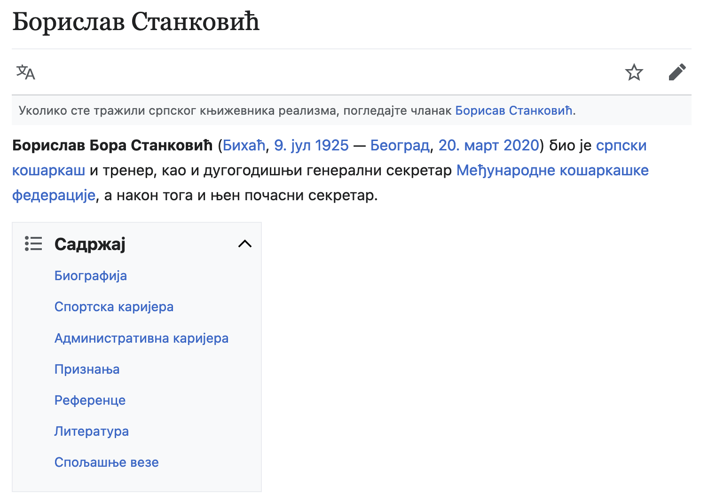

Повезивање докумената
=====================

Често имамо потребу да одвајамо садржај у посебне документе. Замислимо да имамо 3 различите особе за које смо направили одвојен документ.

.. table::

    ==================  ==========================
    Научник             Назив документа
    ==================  ==========================
    Никола Тесла        ``NikolaTesla.html``
    Михајло Пупин       ``MihajloPupin.html``
    Милутин Миланковић  ``MilutinMilankovic.html``
    ==================  ==========================

Ако желимо да направимо документ ``Sadrzaj.html`` који би имао везе (енгл. *link*) ка овим документима, могли бисмо да искористимо елемент ``<a>`` (енгл. *anchor*).

Елемент ``<a>`` прима атрибут ``href`` коме је могуће проследити име стране са којом желимо да повежемо садржај:

.. code-block:: html
   :caption: Линкови ка документима:

    <a href="NikolaTesla.html">Никола Тесла</a> 
    <a href="MihajloPupin.html">Михајло Пупин</a> 
    <a href="MilutinMilankovic.html">Милутин Миланковић</a>

Елемент ``<a>`` омогућава читаоцу да одабере (кликне, тапне) на текст унутар ``<a>`` елемента и том акцијом пређе на *HTML* документ који је наведен као вредност ``href`` атрибута. На овај начин можемо да направимо везе од једног *HTML* документа ка осталима.

Релативни линкови
-----------------

*HTML* документи који се користе у претходном примеру се налазе у истом директоријуму као и документ у коме се налазе *HTML* елементи ``<a>``. Међутим, ништа нас не спречава да фајлове распоредимо по посебним директоријумима и да их повежемо. Посматрајмо следећи пример:

====================  ===================================
Особа                 Назив документа
====================  ===================================
Никола Тесла          ``naucnici/NikolaTesla.html``
Михајло Пупин         ``naucnici/MihajloPupin.html``
Милутин Миланковић    ``naucnici/MilutinMilankovic.html``
Драгослав Шекуларац   ``fudbaleri/DragoslavSekularac.html``
Дејан Станковић       ``fudbaleri/DejanStankovic.html``
Драган Манце          ``fudbaleri/DraganMance.html``
Саша Илић             ``fudbaleri/SasaIlic.html``
Бора Станковић        ``kosarkasi/BoraStankovic.html``
Саша Ђорђевић         ``kosarkasi/SasaDjordjevic.html``
====================  ===================================

Да би се направио линк ка неком документу, потребно је навести путању, укључујући директоријум у ком се документ налази:

.. code-block:: html
   :caption: Релативни линкови:

    <a href="naucnici/NikolaTesla.html">Никола Тесла</a> 
    <a href="naucnici/MihajloPupin.html">Михајло Пупин</a> 
    <a href="naucnici/MilutinMilankovic.html">Милутин Миланковић</a>
    <a href="fudbaleri/DragoslavSekularac.html">Драгослав Шекуларац</a> 
    <a href="fudbaleri/DejanStankovic.html">Дејан Станковић</a> 
    <a href="fudbaleri/DraganMance.html">Драган Манце</a> 
    <a href="fudbaleri/SasaIlic.html">Саша Илић</a> 
    <a href="kosarkasi/BoraStankovic.html">Бора Станковић</a>
    <a href="kosarkasi/SasaDjordjevic.html">Саша Ђорђевић</a> 

Ово су такозвани **релативни линкови**, који нам омогућавају да одведемо читаоца од тренутне стране ка другој страни.

У претходним примерима се референцирају стране које се налазе у поддиректоријумима, али релативни линкови нам омогућавају и да пређемо у наддиректоријум коришћењем две тачке ``..``, које представљају директоријум на вишем нивоу.

На пример, замислимо да се читалац налази на страни ``fudbaleri/DraganMance.html`` и да желимо да га одведемо на страну ``kosarkasi/SasaDjordjevic.html`` када одабере линк. На страни ``fudbaleri/DraganMance.html`` бисмо ставили следећи релативни линк:

.. code-block:: html
   :caption: Релативни линк који користи наддиректоријум:

    <a href="../kosarkasi/SasaDjordjevic.html">Саша Ђорђевић</a> 

Апсолутни линкови
-----------------

Поред докумената који се налазе у различитим директоријумима у оквиру тренутног сајта, можемо да направимо везе ка странама које се налазе на потпуно другим веб-сајтовима. У том случају би требало да ставимо пун *URL* који наводимо и у прегледачу када желимо да одемо на неку страну. Елемент са везом ка страни *Википедије* би изгледао овако:

.. petlja-editor:: html

   index.html
   <!doctype html>
   <html>
     <body>
       <a href="https://sr.wikipedia.org/sr-ec/Борислав_Станковић">Борислав Станковић</a>
     </body>
   </html>

Ово су такозвани **апсолутни линкови**, помоћу којих се задаје пуна *URL* адреса до жељене стране.

Једна од најчешћих грешака које се праве је изостављање ``http://``, односно ``https://`` префикса у апсолутном линку, као што је приказано у следећем примеру:

.. code-block:: html
   :caption: Апсолутни линк без префикса:

    <a href="sr.wikipedia.org/sr-ec/Борислав_Станковић">Борислав Станковић</a>

Ако ставите вредност ``href`` атрибута без префикса, прегледач ће сматрати да желите да отворите локални фајл ``Борислав_Станковић``, који се налази унутар фолдера: ``sr.wikipedia.org/sr-ec``.

Префикс ``http://`` (или ``https://``) у вашој *HTML* референци говори прегледачу да треба да потражи референцирани документ на другом веб-сајту, а не локално. Зато ћете у већини случајева добити грешку ако га изоставите.

Интерни линкови
---------------

У неким случајевима ће вам бити потребно да направите везе које не воде ка другим странама, него ка секцијама унутар исте стране. Најчешћи пример у коме би вам ово било потребно је прављење садржаја на почетку стране.

На следећој слици је приказан садржај стране о Бориславу Станковићу са линковима ка различитим секцијама (*Биографија*, *Остало*, *Референце*, *Литература*, *Спољашње везе*) на истој веб-страни о овом славном кошаркашу, тренеру и кошаркашком функционеру:

Ако одаберете било који од ових линкова, нећете прећи на нову страну на којој можете наћи више информација. Уместо тога, прегледач ће вас само позиционирати на део тренутне стране где се налазе информације које желите да прочитате. Да бисте могли да користите интерне линкове, потребно је да урадите следеће:

- Уведите идентификаторе *HTML* елемената на које омогућавате прелазак (нпр. *биографија*, *референце* итд. у претходној слици) и обележите елементе тим идентификаторима.
- Направите линкове који референцирају те обележене елементе и од њих формирајте садржај.

Елементи се могу јединствено идентификовати помоћу тзв. идентификатора, који су задати као вредности у ``id`` атрибуту *HTML* елемента. На пример, ако имамо више наслова у документу, сваком од њих можемо да доделимо идентификатор тако што ставимо неку вредност у атрибут ``id`` сваког наслова.

.. code-block:: html
   :caption: Идентификатори елемената:

    <h1 id="biografija">Биографија</h1>
    
...

    <h1 id="ostalo">Остало</h1>
    
...

    <h1 id="reference">Референце</h1>
    
...

    <h1 id="literatura">Литература</h1>
    
...

    <h1 id="spoljasnje">Спољашње везе</h1>
    
...

.. suggestionnote::

    Идентификатори треба да буду јединствени у страни, тако да прегледач може да идентификује тачно један елемент на који треба прећи по захтеву читаоца.

Када дефинишемо идентификаторе, потребно је да направимо ``<a>`` елементе који упућују читаоца на њих. Ово постижемо тако што као вредност атрибута ``href`` ставимо **идентификатор секције** на коју треба прећи, са знаком ``#`` на почетку.

.. code-block:: html
   :caption: Интерни линкови:

    <a href="#biografija">Биографија</a> 
    <a href="#ostalo">Остало</a> 
    <a href="#reference">Референце</a> 
    <a href="#literatura">Литература</a> 
    <a href="#spoljasnje">Спољашње везе</a> 

Ако се одабере линк о биографији, прећи ће се на елемент са идентификатором *biografija*.

.. petlja-editor:: interni_linkovi_html

   index.html
   <!doctype html>
   <html>
     <body>
       <h1>Садржај</h1>

       <ul>
         <li>
           <a href="#biografija">Биографија</a>
         </li>
         <li>
           <a href="#ostalo">Остало</a>
         </li>
         </li>
         <li>
           <a href="#reference">Референце</a>
         </li>
         <li>
           <a href="#literatura">Литература</a>
         </li>
         <li>
           <a href="#spoljasnje">Спољашње везе</a>
         </li>
       </ul>

       <h1 id="biografija">Биографија</h1>
       
...

       <h1 id="ostalo">Остало</h1>
       
...

       <h1 id="reference">Референце</h1>
       
...

       <h1 id="literatura">Литература</h1>
       
...

       <h1 id="spoljasnje">Спољашње везе</h1>
       
...

     </body>
   </html>

У претходном примеру су коришћене интерне везе ка секцијама у тренутној страни. У случају да нам је потребно да усмеримо читаоца на одређену секцију у оквиру неке друге стране, можемо да комбинујемо линкове ка другим странама и идентификаторе, како бисмо водили читаоца на тачно одређену позицију у документу, уместо да га увек поставимо на почетак документа.

.. petlja-editor:: apsolutni_linkovi_identifikator_html

   index.html
   <!doctype html>
   <html>
      <body>
        <a href="https://sr.wikipedia.org/sr-ec/Борислав_Станковић#Биографија">Биографија</a>
        <a href="https://sr.wikipedia.org/sr-ec/Борислав_Станковић#Признања">Признања</a>
        <a href="https://sr.wikipedia.org/sr-ec/Борислав_Станковић#Референце">Референце</a>
      </body>
   </html>

Ако читалац одабере први линк, прегледач ће га одвести на Википедија страну o Бори Станковићу, али уместо да прикаже почетак стране, позиционираће се на секцију о `биографији Боре Станковић <https://sr.wikipedia.org/sr-ec/Борислав_Станковић#Биографија>`_.

.. infonote::

    Када задржите показивач миша на неком линку, ваш веб-прегледач ће вероватно у доњем левом углу да прикаже веб-адресу до које тај линк води. На пример, ако позиционирате миша `овде <https://sr.wikipedia.org/sr-ec>`_, требало би да видите адресу ``https://sr.wikipedia.org/sr-ec``.

