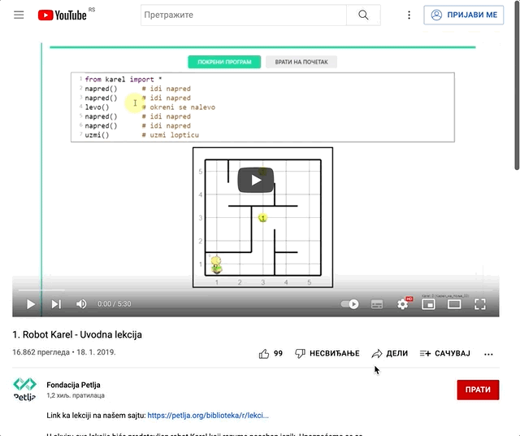

Мултимедијални садржаји
=======================

*HTML* документи омогућавају да у њих ставите мултимедијалне садржаје као што су слике, видео и аудио фајлови. На овај начин, *HTML* документи постају много више од страна које можете наћи у књигама. У овој лекцији ћемо научити како се прави мултимедијални садржај помоћу *HTML* докумената.

Слике
-----

Слике су, у највећем броју случајева, фајлови који се чувају одвојено од *HTML* докумената (најћешће у неком поддиректоријуму). Слике се постављају у документ на сличан начин као и линкови – помоћу елемента ````, који у свом атрибуту ``src`` садржи име слике коју треба приказати:

.. code-block:: html
   :caption: Слика Николе Тесле:

    </img>
    
Елемент ```` нема садржај, тј. ништа не наводимо између отварајућег и затварајућег тага. Зато се овај елемент може написати и као самозатварајући таг, овако:

.. petlja-editor:: slika_nikola_tesla_html

    index.html
    <!doctype html>
    <html>
      <body>
        
        <p>
          Autor: Martin van Meytes, Public domain, via Wikimedia Commons
        </p>
      </body>
    </html>

.. infonote::

    Подсетимо се, самозатварајући таг је целина за себе и нема пратећег парњака, јер не ограничава део текста који припада његовом елементу. Раније смо помињали *HTML* елемент ``<br/>`` (прелазак у нови ред), који се такође представља самозатварајућим тагом. 
    
    Елемент ```` је још један елемент који може да буде цео садржан у једном самозатварајућем тагу.

Поред ``src`` атрибута, свака слика треба да има текст који ће се приказати уместо ње у случају да се слика не може учитати или приказати у прегледачу. Овај текст се ставља у оквиру ``alt`` атрибута.

*HTML* елемент ```` веома личи на елементе везе објашњене у претходној лекцији, уз једну разлику. Слика која се референцира се директно убацује и приказује на месту овог елемента.

Поред ``src`` и ``alt`` атрибута, слика треба да има и ``title`` атрибут, који описује слику и приказује се када неко пређе мишем преко ње. Друга, можда и важнија намена атрибута ``title`` је да претраживачи као што су *Google* или *Bing* имају на располагању описе слика, што им омогућава квалитетније рангирање резултата претраге.

Формати слика
^^^^^^^^^^^^^

Помоћу елемента ```` прегледач може да прикаже слике у различитим форматима, као што су *JPG/JPEG*, *PNG*, *WEBP*, *SVG*. Избор формата, величине, компресије и резолуције слике је компромис између брзине учитавања и квалитета и намене слике.

На веб-странама се најчешће користе *JPEG* формати, зато што дају најбољи однос квалитета и величине слике.

*PNG* формат се може користити како би се приказале квалитетније слике, али често је цена спорије учитавање стране. Због брзине учитавања посебно треба избегавати формате намењене пре свега за квалитетно штампање, као што је *TIFF*, јер су фајлови у том формату често велики.

*GIF* слика се често користи када је потребно направити неку анимирану илустрацију, која је довољно једноставна и не захтева пратећи аудио или контроле (пауза, заустављање, позиционирање на неки тренутак).

Пожељно је користити прогресивни формат слика (нпр. прогресивни *JPEG*) у случају да су слике веће и спорије се учитавају. Класични формати исцртавају део по део слике (у хоризонталним тракама), док прогресивни исцртају одмах целу слику, али лошијег квалитета (замућено). Потом се, како се учитава додатни садржај слике, квалитет приказа поправља и слика се изоштрава.

Постоје и векторски формати као што је *SVG* (енгл. *Scalable Vector Graphics*). Предност векторских формата је могућност увеличања слике без губитка квалитета јер се њихов опис своди на дефинисање линија, облика фигура и боја.

Видео материјали
----------------

*HTML* језик нам омогућава да у веб-страну поставимо видео-материјале који се могу приказати у тој страни. Као и слике, видео-фајлови се снимају одвојено од *HTML* докумената (нпр. видео може да буде снимљен као посебан фајл ``movie.mp4``). У том случају је потребно у *HTML* документ ставити *HTML* елемент ``<video>``, који ће у себи имати везу ка видео-фајлу.

.. petlja-editor:: video_fajl_html

    index.html
    <!doctype html>
    <html>
      <body>
        <video controls width="500">
          <source src="http://localhost:1234/video.mp4" type="video/mp4" />
          Ако видите овај текст, онда ваш прегледач не може да прикаже видео.
        </video>
      </body>
    </html>

Елемент ``<video>`` у себи садржи *HTML* елемент ``<source>`` (представља се самозатварајућим тагом), који представља линк на видео-фајл који треба приказати.

У случају да постоји више елемената ``<source>`` у оквиру истог ``<video>`` елемента, прегледач ће покушати да прикаже први, а ако не може да га прикаже, онда ће прећи на следећи.

Унутар елемента ``<video>`` се може наћи и текст који ће бити приказан у случају да прегледач не може да покрене видео. Пример: ако фајл није на задатој локацији, ако је оштећен, или ако прегледач не може да покрене такав тип видеа.

Уз видео се могу ставити и преводи помоћу ``<track>`` елемента.

Елемент ``<video>`` има још неколико корисних својстава којима се може дефинисати понашање ове контроле.

============  =====================================================================
Атрибут       Опис
============  =====================================================================
``controls``  Приказује алатку са контролама за покретанје и заустављање видеа
``autoplay``  Дефинише да је потребно покренути видео чим се учита
``loop``      Стално понавља видео из почетка
``poster``    Представља слику која ће бити приказана пре него што се видео покрене
============  =====================================================================

Пример видео-фајла са контролама, који се стално понавља, има постер и пример превода:

.. petlja-editor:: video_fajl_kontrole_html

    index.html
    <!doctype html>
    <html>
      <body>
        <video controls loop poster="http://localhost:1234/video-poster.jpg" width="500">
          <source src="http://localhost:1234/video.mp4" type="video/mp4" />
          <!-- Српски превод - WEBVTT формат превода -->
          <track
            default kind="captions"
            srclang="rs" label="Српски"
            src="http://localhost:1234/video.vtt" />
          Ако видите овај текст, онда ваш прегледач не може да прикаже видео.
        </video>
      </body>
    </html>

Више информација о елементу ``video`` можете наћи на
`страни о елементу video <https://www.w3schools.com/tags/tag_video.asp>`_ sajta *W3 schools*.

Оквири
------

Постоји још један начин да се прикажу видео фајлови, а то је елемент ``<iframe>``.

``<iframe>`` је *HTML* елемент којим можете да укључите садржај друге *HTML* стране или документа у тренутну страну. На пример, у случају да желимо да у *HTML* документу прикажемо неки *YouTube* видео, можемо у нашу страну да поставимо ``<iframe>`` *HTML* елемент, коме је у ``src`` атрибуту уписано одакле треба да прочита видео:

.. comment

    Da li treba da se postavi link na interni video (mediastorage)?

.. petlja-editor:: iframe_yt_embed_html

    index.html
    <!doctype html>
    <html>
      <body>
        <iframe src="https://www.youtube.com/embed/s9KCMku_StY?list=PLWXhVV6d5_uXFh9vOfagoU4FzJJlV3oWz">
        </iframe>
      </body>
    </html>
    
Ове елементе је лако додати у *HTML* стране када желите да убаците у страну неки *YouTube* видео. Довољно је да одете до видеа који желите да убаците, одаберете *Share* (подели) опцију и као начин за дељење одаберете *Embed* (убачени) тип дељења:



Све што је потребно да урадите је да овај *HTML* кôд убаците у вашу страну и *YouTube* видео ће бити пуштен.

Аудио-материјали
----------------

*HTML* нам омогућава да поставимо аудио-материјале унутар веб-стране помоћу елемента ``<audio>``, као што је приказано у следећем примеру:

.. code-block:: html

    <audio controls>
        <source src="himna.ogg" type="audio/ogg" />
        <source src="himna.mp3" type="audio/mpeg" />
        Ако видите овај текст, онда ваш прегледач не подржава <audio> елемент.
    </audio>

Елемент ``<audio>`` омогућава да пустите („одсвирате“) аудио-материјале у *MP3*, *WAV* и *OGG* формату, мада различити прегледачи могу да имају подршку за само неке од ових формата. Због тога се у оквиру елемента ``<audio>`` обично наводи неколико аудио-фајлова, како би прегледач могао да употреби фајл чији формат подржава.

Као и у случају елемента ``<video>``, постоји неколико својстава помоћу којих можемо да задамо прегледачу како да прикаже контролу и пусти аудио-запис. На пример, ``controls`` дефинише да је потребно приказати контроле за покретање и заустављање аудио-материјала, ``loop`` да је потребно стално понављати аудио материјал, док ``autoplay`` задаје да аудио-запис треба одмах покренути чим се садржај учита.

.. petlja-editor:: audio_html

   index.html
   <!doctype html>
   <html>
     <body>
       <audio controls loop>
         <source src="http://localhost:1234/ding.mp3" type="audio/mpeg" />
         Ако видите овај текст, онда ваш прегледач не може да прикаже аудио.
       </audio>
     </body>
   </html>

Више информација о елементу ``audio`` можете наћи на `страни о аудио елементу <https://www.w3schools.com/tags/tag_audio.asp>`_ сајта *W3 schools*.
