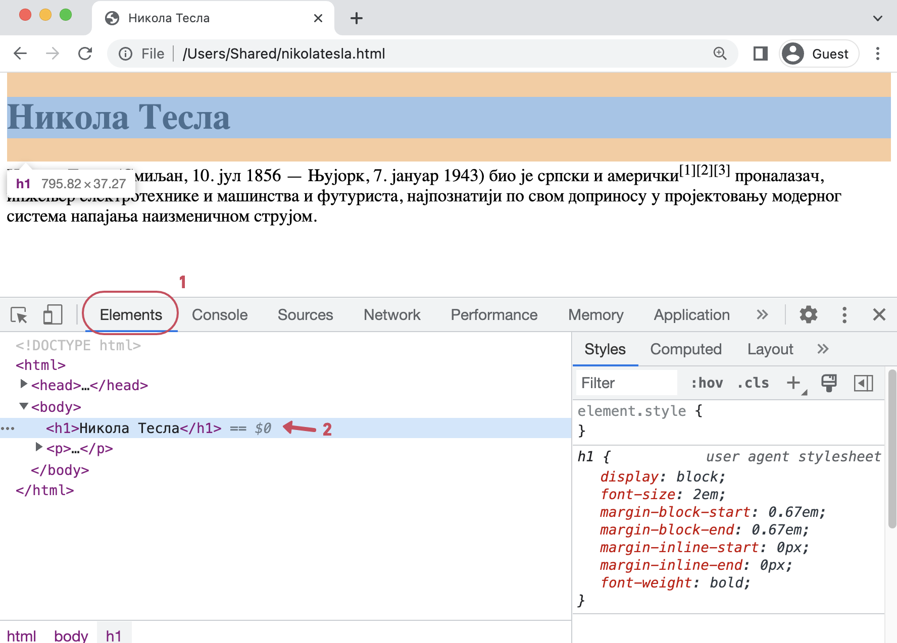
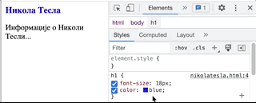

CSS стилови
===========

Веб-дизајн
----------

Ако распоредите *HTML* елементе у документу као што је описано у претходним лекцијама, ти елементи ће бити постављени један испод другог и прегледач ће користити неке подразумеване стиловe (боје, величине слова, размаке) како би их приказао.

Елементе на правим веб-странама је често потребно распоредити и стилизовати у складу са наменом сајта. **Веб-дизајн** је активност којом се описује како ће страна и елементи на њој изгледати. Веб-дизајн је тесно повезан и са другим областима дизајна као што је организација информација на сајту и правила за једноставно коришћење сајта (енгл. *User Experience*).

CSS (Cascading Style Sheets)
----------------------------

Као што је *HTML* језик којим се описује структура и садржај елемената који ће бити приказани на веб-страни, тако постоји и посебан језик који се користи за описивање изгледа и геометријског распореда ових елемената. Овај језик се назива *CSS* (енгл. Cascading Style Sheets).

Језиком *CSS* се представљају правила која дефинишу како треба да изгледају елементи на веб-страни. На пример, на језику *CSS* се *HTML* елементима додељују својства као што су ``color``, ``background-color`` и слично, како би се дефинисало којом бојом треба приказати текст у елементу, или која ће бити боја позадине.

Инспектор
---------

У сваком веб-прегледачу можете да пронађете *HTML* кôд било ког елемента приказане веб-стране и да испитате која својства има тај елемент и зашто баш тако изгледа. Код већине прегледача притиском на тастер *F12* отвара се додатни прозор у доњем делу прегледача, као на следећој слици:

На пример, у прегледачу *Chrome* се у доњем делу отвара прозор у коме се види *HTML* кôд којим је описана структура елемената стране, као и стилови (доле десно) који су примењени на те елементе да би се добио жељени изглед стране.

Померајте миша преко *HTML* кôда и посматрајте шта се дешава. Ако, на пример, задржите миша изнад текста ``<h1>Никола Тесла</h1>`` (означено стрелицом и бројем 2), тај део кôда постаје осенчен, а биће означен и одговарајући део документа (наслов) у приказу у горњем делу прегледача. Изглед наслова је дефинисан кодом на десној страни.

.. code-block:: css

  h1 {
    font-size: 18px;
    color: blue;
  }

Овако изгледа скуп подешавања било ког стила. У сваком подешавању се са леве стране двотачке налази име својства које треба подесити, а са десне вредност. У примеру се дефинише да ће боја слова бити плава, а величина фонта 18 пиксела.

Прегледачи имају неке предефинисане (подразумеване) стилове за велики број *HTML* елемената, да би знали како да их прикажу ако стил није прецизиран. У случају да нам ти предефинисани стилови не одговарају, ми увек можемо да дефинишемо своје стилове којима ћемо описати како стране треба да изгледају у прегледачу.

У самом инспектору је могуће мењати својства и видети промену тренутно без снимања стране. Пример промене боје наслова из плаве у црвену:

