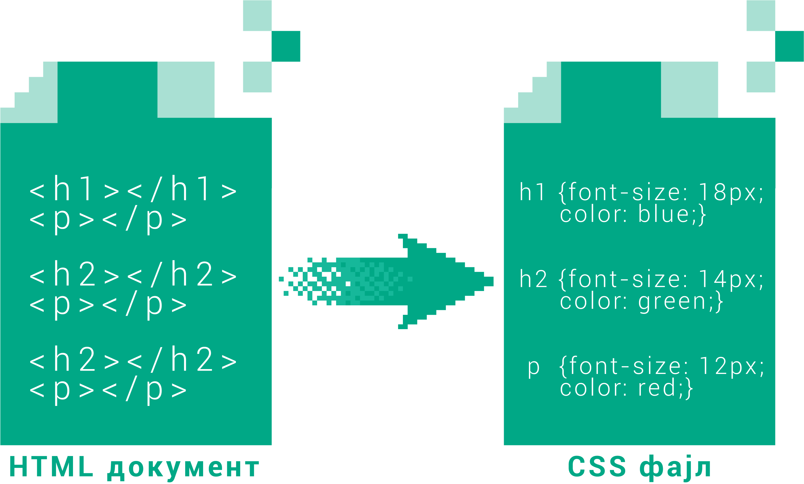

Дефинисање *CSS* стилова
------------------------

*CSS* стилове је могуће дефинисати на неколико начина:

#. у одвојеним фајловима,
#. у *HTML* страни користећи ``
        </head>
        <body>
            <h1>Наслов</h1>
            
Неки текст.

        </body>
    </html>

Овако дефинисани стилови се могу применити само на елементе *HTML* документа у коме су наведени.

*CSS* у атрибуту
----------------

Могуће је дефинисати стил појединих елемената стране додавањем атрибута ``style`` у сам *HTML* елемент, на пример:

.. code-block:: html

    

        Неки текст.
    

Задавање стила помоћу атрибута ``style`` у HTML елементу је познато као инлајн стил (енгл. *inline CSS*).

Употреба *HTML* елемента ``<style>`` у заглављу веб стране и атрибута ``style`` у њеним елементима **се данас сматра лошом праксом и не треба их користити при дизајнирању сајтова**. Овакав начин задавања стила може узроковати неконзистентност у изгледу страна и захтева експертско знање да би се идентификовали проблеми. Овај приступ је имао више смисла у почетку развоја веба, када је због спорог интернета било важно да се све што је потребно за дефинисање изгледа и садржаја стране налази у једном фајлу, и када су сајтови били мањи и једноставнији него данас.

Овај начин дефинисања стилова и даље може бити погодан за једноставне примере, у којима се у једном документу у потпуности дефинише и структура и изглед стране. Ми ћемо за наше примере користити овај начин у наставку, а сличне примере можете наћи и на сајтовима као што је *W3CSchools*.

Још једном наглашавамо да у пројектима који садрже више страна (на пример, ако правите једноставан сајт ради вежбе) треба да користите само препоручени начин рада, а то је држање *CSS* кода у посебном фајлу.
