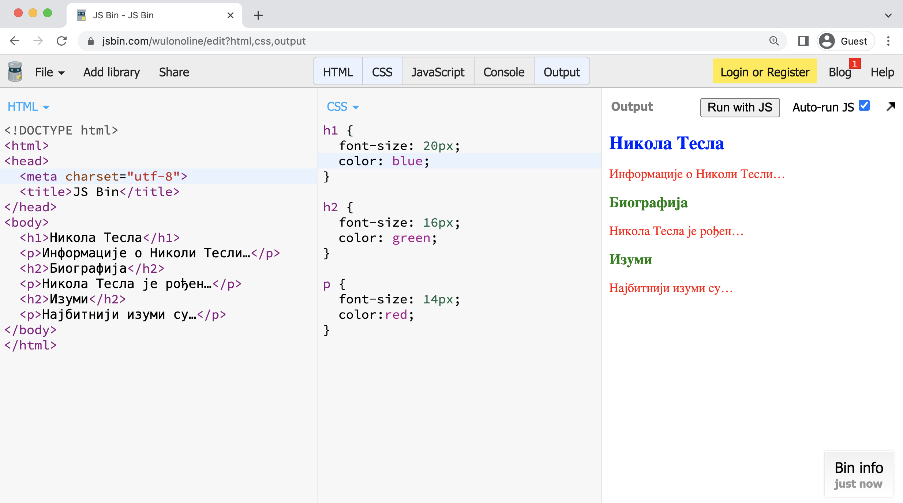

CSS стилови – вежбе
===================

Вежба 1 – Стилизовање онлајн
----------------------------

Најлакши начин да испробате како се стилизују елементи (када нисте на страницама овог курса) је коришћењем следећег веб сајта: `https://jsbin.com/?html,css,output <https://jsbin.com/?html,css,output>`_. Овај сајт смо користили док смо учили да пишемо HTML кôд да бисмо видели како ће се одређени *HTML* елемент приказати. На истом сајту поред *HTML* кôда можемо да унесемо и *CSS* кôд, при чему ћемо видети како *CSS* правила која задамо утичу на изглед *HTML* елемената.

У овом примеру смо применили величину од 18 пиксела и плаву боју на ``<h1>`` елемент, величину од 16 пиксела и зелену боју на ``<h2>`` елемент, а величину од 12 пиксела и црвену боју на ``
`` елемент. Приметите да се дефиниције стилова за ``h2`` из *CSS* колоне примењују на оба елемента ``<h2>`` у *HTML* кôду (исто важи и за дефиниције стилова пасуса). Прегледач ће применити дефиниције стилова на све *HTML* елементе у страни који одговарају наведеном опису.

*CSS* фајл има листу правила за приказивање у облику:

.. code::

    опис-елемената { скуп дефиниција својстава }
    опис-елемената { скуп дефиниција својстава }
    опис-елемената { скуп дефиниција својстава }

Опис елемената (или селектор) говори прегледачу на које елементе треба применити правила наведена у витичастим заградама. У претходном примеру су коришћени једноставни селектори – наведено је име *HTML* елемената на које ће се применити правила, на пример ``h1``, ``h2`` и ``p``. У наставку ћемо видети да селектори могу да буду и доста сложенији.

Скуп дефиниција садржи елементе у којима је наведено неко својство *HTML* елемента и вредност тог својства које треба да буде примењено на HTML елемент. Својство елемента је, на пример, боја (енгл. *color*) или величина текста (енгл. *font-size*).

Вежба 2 – Стилизовање локално
-----------------------------

У претходном примеру смо *HTML* стилизовали на сајту за брзи развој и стилизовање једноставних HTML докумената. Међутим, исто можемо да урадимо и са документима снимљеним на локалном рачунару.

*HTML* документ из претходног примера можемо да формирамо помоћу било ког програма за уређивање текста (едитора). Сачувајте следећи садржај као фајл ``nikolatesla.html`` у неком локалном директоријуму (нпр. ``c:\temp``).

.. code-block:: html

    <!DOCTYPE html>
    <html>
        <head>
          <link rel="stylesheet"  href="stil.css">
        </head>
        <body>
             <h1>Никола Тесла</h1>
             
Информације о Николи Тесли…

             <h2>Биографија</h2>
             
Никола Тесла је рођен…

             <h2>Изуми</h2>
             
Најбитнији изуми су…

        </body>
    </html>

Обратите пажњу на елемент ``<link rel="stylesheet" href="stil.css">``, којим дефинишемо да ће се стилови налазити у фајлу ``stil.css`` у истом директоријуму као и фајл ``nikolatesla.html``.

Формирајте фајл ``stil.css`` са следећим садржајем и сачувајте га у истом директоријуму као и претходни фајл:

.. code-block:: css

    h1 { font-size: 18px;
            color: blue;}
    h2 { font-size: 14px;
            color: green;}
    p { font-size: 12px;
             color:red; }

Отворите фајл ``nikolatesla.html`` у прегледачу и проверите да ли су боје текста које су дефинисане у CSS стиловима примењене на документ.
