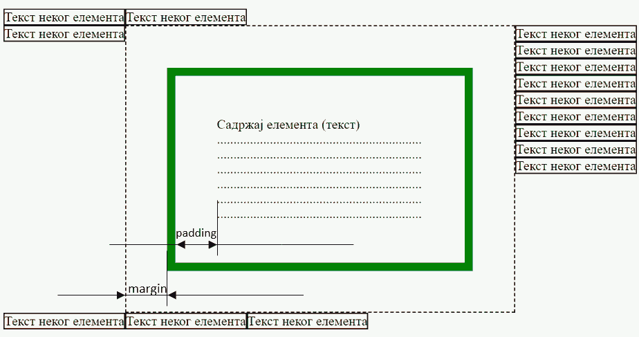

CSS Својства која дефинишу границе елемента
===========================================

*CSS* стилови нам омогућавају да за сваки *HTML* елемент дефинишемо његове димензије, растојање које треба направити између садржаја тог елемента и околних елемената и слично. *HTML* елементи имају у себи садржај (илустрације ради, претпоставимо да је садржај обичан текст) око кога се налази невидљиви оквир, који представља границу тог елемента. *CSS* стилови нам омогућавају да помоћу следећих својстава дефинишемо положај границе елемента у односу на садржај унутар елемента и у односу на околне елементе:

- ``padding`` - величина подручја унутар елемента, у коме садржај елемента не може да се појави. Ово својство ће одгурнути садржај елемента од ивице ка унутрашњости.
- ``border`` - ивица елемента. Овим својством можете да контролишете стил, ширину и боју ивице.
- ``margin`` – величина подручја ван елемента, у коме не могу да се појаве други елементи и њихови делови.
- ``background`` – дефинише како ће изгледати позадина садржаја елемента. У оквиру овог својства се може дефинисати боја позадине, прозирност (транспарентност), слика која ће се поставити у позадини и слично. Ово се постиже помоћу *CSS* својстава као што су ``background-color``, ``background-image`` итд. Више информација о подешавању позадина елемената можете пронаћи на *W3CSchools* сајту.

На следећој слици је приказано шта би елемент који има подешена својства урадио са својим садржајем и неким околним елементима:

Својство ``border`` може, на пример, да дефинише да је оквир елемента зелене боје и дебљине 5 пиксела. Садржај елемента неће моћи да се постави од ивице до ивице, него ће бити одмакнут од ивица за вредност која је постављена у својству ``padding``. Елементи који се налазе око овог елемента неће моћи да се поставе уз ивицу него ће бити одмакнути за вредност која је постављена у својству ``margin``.

У следећем примеру је приказано као се подешава оквир око елемента:

.. petlja-editor:: css_borders_1

    style.css
    p {
        border-size: 5px;
        border-style: solid;
        border-color: green;

        padding: 50px;
        margin: 20px;
    }
    ~~~
    test.html
    <link rel="stylesheet" href="style.css"/>
    
Параграф текста

У овом примеру су дефинисане величина и боја ивице елемената помоћу *CSS* својстава ``border-size``, ``border-color``.  Својство ``border-style`` је слично стиловима линија на које сте наилазили у процесорима текста и описује да ли ивицу треба исцртати као пуну (``solid``), испрекидану (``dashed``), тачкасту (``dotted``) и слично. Пронађите остале врсте линија и испробајте их на *W3CSchools* сајту.

У неким случајевима ћете наићи на компактнији облик дефиниције *CSS* стила, у коме се својству ``border`` додељују све вредности:

.. petlja-editor:: css_borders_2

    style.css
    p {
        border: 5px solid green;
    }
    ~~~
    test.html
    <link rel="stylesheet" href="style.css"/>
    
Параграф текста

*CSS* стил из претходног примера се примењује на све ивице оквира (горњу, доњу и бочне). Међутим, *CSS* језик дозвољава и финију контролу и омогућава да поставимо посебне вредности за сваку ивицу оквира:

.. petlja-editor:: css_borders_3

    style.css
    p {
        margin-top: 100px;
        margin-bottom: 100px;
        margin-right: 50px;
        margin-left: 80px;

        border-top-style: dotted;
        border-right-style: solid;
        border-bottom-style: dotted;
        border-left-style: solid;

        padding-top: 50px;
        padding-right: 30px;
        padding-bottom: 50px;
        padding-left: 80px;
    }
    ~~~
    test.html
    <link rel="stylesheet" href="style.css"/>
    
Пaраграф текста

