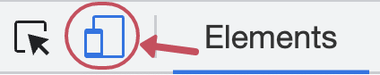
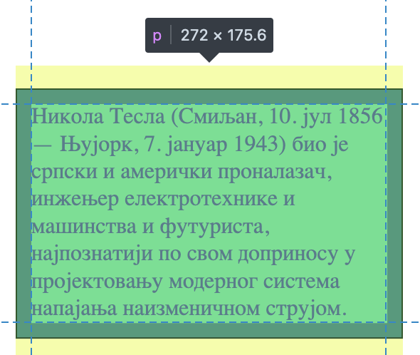

CSS Димензије елемената
=======================

Један од изазова у дизајнирању веб-страна је да се постигне да иста страна добро изгледа на екранима различитих величина (од паметних телефона до монитора високе резолуције). Дизајнирање за различите величине екрана зове се респонзивни дизајн (енгл. *responsive design*). Помоћу *CSS* стилова можемо да постигнемо значајну флексибилност у изгледу стране, тако што подесимо својства описана у наставку, која се односе на димензије елемената.

При употреби ових својстава је важно је да се проверава како веб-страна изгледа у прозорима различите величине. Брз и једноставан начин да симулирамо гледање стране на уређајима са различитом резолуцијом је **да мењамо величину прозора прегледача**. Кликом на икону са два екрана у прозору са алатима за развој приказану на слици испод, добијамо  прецизну контролу величине екрана симулираног циљног уређаја.



Врсте елемената
---------------

Да бисмо разумели како *CSS* стилови омогућавају да се дефинишу димензије *HTML* елемената, треба прво знати да *HTML* елементи могу грубо да се поделе на:

- ``block`` елементе као што су ``<p>``, ``<table>``, ``<ul>``, ``<ol>``, или ``<div>``, који заузимају сву ширину која им је на располагању. Подразумевано понашање ових елемената је да се увек позиционирају у новом реду, ширина им је највећа могућа у надређеном елементу, а висина им зависи од количине садржаја.
- ``inline`` елементе који заузимају најмању могућу ширину која им је потребна. Подразумевано понашање им је да се поставе у исти ред као и остали ``inline`` елементи, а ширина им зависи од садржаја. Примери оваквих елемената су ``<a>``, ```` и ``<span>``.
- ``inline-block`` елементе који су слични ``inline`` елементима. Разлика између ``inline-block`` и ``inline`` елемената је што ``inline`` елементима није могуће доделити ширину и висину.

.. petlja-editor:: css_dimenzije_1

    style.css
    p {
        background-color: skyblue;
    }
    /* класе ћемо учити у некој од наредних лекција */
    .inline-block {
        display: inline-block;
    }
    ~~~
    index.html
    <!doctype html>
    <html>
    <head>
        <link rel="stylesheet" href="style.css"/>
    </head>
    <body>
        <p>
            Параграф је <code>block</code> елемент и заузима целу ширину.
        </p>
        <p>
            Зато параграф иде у нов ред без обзира на садржај.
        </p>
        <!--
            Приказаће се у истом реду и ширина ће зависити
            од садржаја зато што су inline-block.
        -->
        <p class="inline-block">
            Овај параграф је <code>inline-block</code>.
        </p>
        <p class="inline-block">
            Овај параграф је <code>inline-block</code>.
        </p>
        <a href="#"><code>inline</code> Линк</a>
    </body>
    </html>

Величина елемента
-----------------

Прегледач ће, у зависности од типа елемента, сам одлучити да ли ће за његов приказ користити најмању довољну ширину или ће користити пуну ширину од једне до друге ивице надређеног елемента. *HTML* елементима се може експлицитно дефинисати ширина помоћу *CSS* својстава. Најбитнија *CSS* својства која се могу искористити су:

- ``min-width``, ``max-width``, ``width`` која дефинишу минималну, максималну и експлицитно задату ширину елемента. Елементу ће бити промењена висина како би се садржај уклопио у задату ширину. У случају да ширина није задата, а природна ширина елемента није мања од минимума нити већа од максимума, ова својства немају никаквог ефекта.
- ``min-height``, ``max-height``, ``height`` која дефинишу минималну, максималну и експлицитно задату висину елемента. У случају да висина није задата, а природна висина елемента није мања од минимума нити већа од максимума, ова својства немају никаквог ефекта.

Својство ``overflow`` дефинише шта треба урадити у случају да садржај елемента не може да се смести у задате димензије. Подразумевано понашање је да се ипак прикаже садржај, али ван елемента. Као алтернатива, вишак садржаја се може сакрити ако се ово својство постави на вредност ``hidden``, а уз то се постављањем вредности на ``scroll`` омогућава читаоцу да скрол траком бира видљиви део текста.

Посматрајмо листу почасних доктората додељених Николи Тесли:

.. petlja-editor:: css_element_sizing

    style.css
    ul {
        width: 250px;
        height: 100px;
        background-color: skyblue;
    }
    ~~~
    index.html
    <!doctype html>
    <html>
    <head>
        <link rel="stylesheet" href="style.css"/>
    </head>
    <body>
        <p>Николи Тесли су додељени следећи почасни докторати:</p>
        <ul>
            <li>Техничка школа, Беч, 1908.</li>
            <li>Универзитет у Београду, 1926.</li>
            <li>Универзитет у Загребу, 1926.</li>
            <li>Техничка школа, Праг, 1936.</li>
            <li>Техничка школа, Грац, 1937.</li>
            <li>Универзитет у Поатјеу, 1937.</li>
            <li>Техничка школа, Брно, 1937.</li>
            <li>Универзитет у Паризу, 1937.</li>
            <li>Политехничка школа, Букурешт, 1937.</li>
            <li>Универзитет у Греноблу, 1938.</li>
            <li>Универзитет у Софији, 1939.</li>
        </ul>
    </body>
    </html>

Листи смо доделили највећу могућу висину и ширину обојена је плавом бојом. Садржај не може да стане у задате димензије и излази ван граница елемента.

.. questionnote::

    **Вежба**

    - Испробајте неке од различитих вредности за својство ``overflow`` у примеру као што су ``hidden``, ``scroll`` и ``none``.
    - Које је понашање ако би уместо својства ``height`` поставили ``max-height``? Колика је висина ако својство ``max-height`` има вредност ``500px`` и зашто?

Величина садржаја
-----------------

Висина и ширина се односе на садржај унутар елемената не рачунајући дебљину ивице (``border-size``) и подручје ``padding``. Ако желимо да се висина и ширина односе и на ова подручја, потребно је додати дефиницију ``box-sizing: border-box``.

Посматрајмо следећи пример са два параграфа идентичног садржаја где смо другом параграфу доделили ``box-sizing: border-box``.

.. petlja-editor:: css_box_sizing

    style.css
    body {
        padding: 50px;
    }
    p {
        width: 250px;
        padding: 10px;
        background-color: lime;
        border: 1px solid green;
    }
    .border-box {
        box-sizing: border-box;
    }
    ~~~
    index.html
    <!doctype html>
    <html>
    <head>
        <meta charset="utf-8"/>
        <link rel="stylesheet" href="style.css"/>
    </head>
    <body>
        <p>
            Никола Тесла (Смиљан, 10. јул 1856 — Њујорк, 7. јануар 1943)
            био је српски и амерички проналазач, инжењер електротехнике
            и машинства и футуриста, најпознатији по свом доприносу
            у пројектовању модерног система напајања наизменичном
            струјом.
        </p>
        <br />
        <p class="border-box">
            Никола Тесла (Смиљан, 10. јул 1856 — Њујорк, 7. јануар 1943)
            био је српски и амерички проналазач, инжењер електротехнике
            и машинства и футуриста, најпознатији по свом доприносу
            у пројектовању модерног система напајања наизменичном
            струјом.
        </p>
    </body>
    </html>

Приметићемо да се први и други параграф разликују у ширини. Кроз инспектор можемо да видимо да је први параграф ширине 272 пиксела, а други 250 пиксела, иако оба имају дефиницију ``width: 250px``.



Прегледач је израчунао ширину од 272 пиксела зато што:

- ``width: 250px`` даје основну ширину садржаја,
- ``padding: 10px`` дефинише простор унутар параграфа од леве и десне ивице; 10 пиксела по страни нам даје 20 пиксела,
- ``border: 1px solid green`` дефинише дебљину ивице; 1 пиксел по страни нам даје 2 пиксела.

Да би избегли овакве ситуације где морамо да рачунамо на задат простор унутар параграфа и ивице, често се у пракси користи ``box-sizing: border-box``. На пример, популарна CSS библиотека Bootstrap на свим елементима дефинише својство на свим елементима користећи универзални селектор ``*``.

.. code-block:: css

    * { box-sizing: border-box; }

На *W3CSchools* сајту пронађите више информација о `моделу оквира <https://www.w3schools.com/css/css_boxmodel.asp>`_ и о `димензијама <https://www.w3schools.com/css/css_dimension.asp>`_.

Пример – слике љубимаца
-----------------------

Искористимо знање из ове и претходних лекција да стилизујемо мобилну апликацију која приказује слике кућних љубимаца.

.. petlja-editor:: css_slike_ljubimaca

    style.css
    /* Поставимо на све елементе модел оквира и величину фонта */
    * {
        box-sizing: border-box;
        font-family: 'Arial', sans-serif;
    }

    main {
        border: 1px solid grey;
        width: 542px;
    }

    a {
        /* padding не ради без inline-block */
        display: inline-block;
        padding: 20px;
        /* Прегледач додаје маргине које не желимо */
        margin: 0;
        /* Додајемо доњу ивицу без боје */
        border-bottom: 2px solid transparent;
        /* Стилизујемо текст */
        color: #b587f6;
        text-align: center;
        text-decoration: none;
    }

    /* Стил који се додељује на прелаз мишем */
    a:hover {
        color: white;
        border-bottom-color: white;
    }

    /* Навигациона трака */
    nav {
        background-color: #6200ee;
        /*
            box-shadow својство додаје сенку.
            Више о својству на W3Schools: https://www.w3schools.com/cssref/css3_pr_box-shadow.asp
        */
        box-shadow: 0px 2px 2px rgba(0, 0, 0, 0.2);
    }

    /* Место за слике */
    section {
        font-size: 0px;
    }

    /* Појединачна слика */
    img {
        object-fit: cover;

        /* Величина слике */
        width: 256px;
        height: 256px;

        /* Маргине слика */
        margin: 10px 0 10px 10px;
    }
    ~~~
    index.html
    <!doctype html>
    <html>
    <head>
        <link rel="stylesheet" href="style.css"/>
    </head>
    <body>

        <main>
            <nav>
                <a href="#">ПСИ</a>
                <a href="#">МАЧКЕ</a>
                <a href="#">ПТИЦЕ</a>
            </nav>

            <section>
                
                
                
                
            </section>
        </main>

    </body>
    </html>

У овом примеру смо користили неколико нових елемената које нисмо имали прилике да видимо раније, а то су:

* ``main`` који представља главну област,
* ``nav`` који представља навигациону траку и
* ``section`` који представља секцију са сликама.

Ови елементи се понашају као ``div`` елементи (``block``), али нам је у контексту овог примера лакше да стилизујемо посебне елементе јер ћемо тек у наредним лекцијама научити више о селекторима.

Апликација има навигациону траку са линковима до различитих врста љубимаца. Линковима смо доделили ``display: inline-block`` да би својство ``padding`` имало ефекта. Испробајте само ``display: inline`` да видите разлику.

Испод навигационе траке приказујемо слике љубимаца. Слике се приказују у реду (``inline``) док стају у ширину садржаја.
