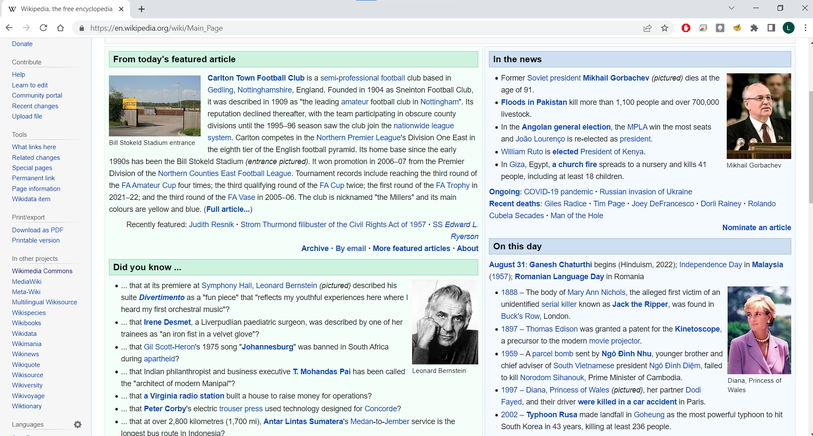

Стилизовање класа елемената
===========================

Овакво стилизовање се користи у случају да је потребно применити исти стил на више елемената различитих типова (нпр. желимо да користимо исту врсту, боју и величину слова у неким параграфима, листама и табелама), или је потребно применити стил на само неке елементе датог типа (нпр. на само неке параграфе). Као пример се могу посматрати наслови у веб-страни Википедије за изабране вести. У зависности од позиције артикла (лева или десна колона), наслови и пасуси имају зелену или плаву позадину.

|

*HTML* елементи на левој и десној страни су истог типа, тако да је потребно некако означити да елементи из леве групе треба да буду приказани другачије од елемената у десној групи. У овом случају је потребно да одаберемо неко име за сваку групу елемената и да у селектор ставимо име те групе са тачком испред имена.

.. petlja-editor:: css_selector_class

    style.css
    .levi {
        display: inline-block;
        width: 100px;
        background-color: lime;
    }

    .desni {
        display: inline-block;
        width: 100px;
        background-color: skyblue;
    }
    ~~~
    test.html
    <link rel="stylesheet" href="style.css"/>
    

        Параграф са зеленом позадином
    

    

        Параграф са плавом позадином
    

Пошто се имена група постављају у оквиру атрибута ``class``, овакве групе елемената називамо **класе** и кажемо да елемент има одређену класу, да припада класи, или да је те класе. Атрибут ``class`` може да садржи једно или више имена класа, на основу којих ће његовом елементу бити постављена својства.

.. petlja-editor:: css_selector_multiple_classes

    style.css
    .blok {
        display: inline-block;
        width: 100px;
    }

    .levi {
        background-color: lime;
    }

    .desni {
        background-color: skyblue;
    }
    ~~~
    test.html
    <link rel="stylesheet" href="style.css"/>
    

        Параграф са зеленом позадином
    

    

        Параграф са плавом позадином
    

Селекторе класа користимо када постоји више елемената на страни (или различитим странама), који треба да изгледају исто. У том случају треба на једном месту дефинисати стил који се односи на класу елемената и ту класу додати свим елементима које желимо да стилизујемо на тај начин.

Стил који се поставља елементу са више класа је унија стилова дефинисаних у различитим класама. У случају да више класа дефинише различите вредности истих *CSS* својстава (нпр. ако и класа ``levo`` и класа ``naslovna`` поставе својство боје текста, али на различите вредности), прегледач ће разрешити конфликте. Правила разрешавања могу да буду компликована, тако да у дизајну треба настојати да до оваквих конфликата не долази.
