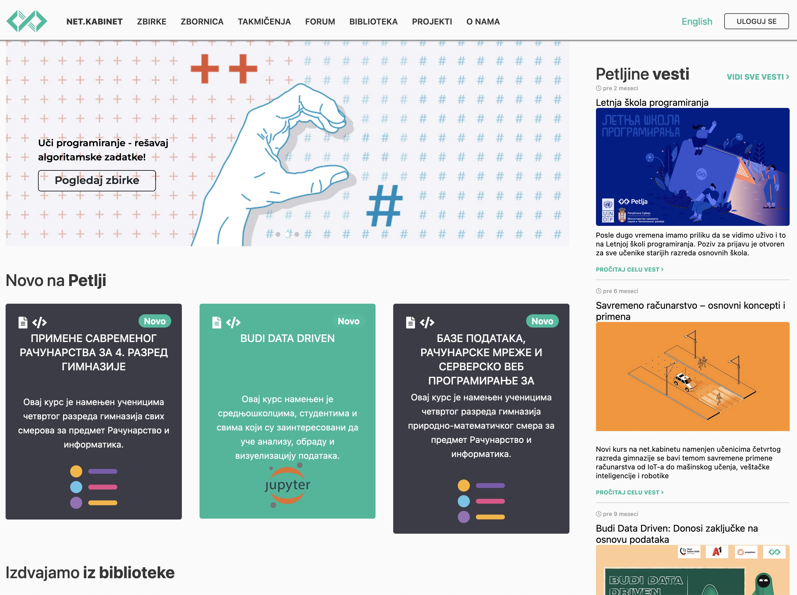

Распоред елемената - пример
===========================

Веб-сајт `Петље <https://petlja.org>`_ је добар пример за приказ распореда елемената.

Навигациона трака и садржај су центрирани. Навигациона трака се дели на два дела. Леви део садржи линкове ка другим странама, док десни део има линк за промену језика и линк за пријаву.

Садржај се такође дели на два дела. У десном делу се налази листа најновијих вести и заузима четвртину простора. Леви део садржи банер који заузима целу ширину док испод њега стоји листа нових курсева.

.. petlja-editor:: css_petlja_org

    style.css
    * {
        box-sizing: border-box;
    }

    body {
        font-family: Arial, sans-serif;
    }

    /* Главни садржај стране је центриран са максималном ширином */
    .strana {
        margin: 0 auto;
        max-width: 960px;
    }

    /* Навигација */
    nav {
        overflow: hidden;
        padding: 8px;
        border-bottom: 1px solid grey;
        margin-bottom: 10px;
    }
    .navigacija-levo {
        padding: 0;
        margin: 0;
        list-style: none;
        float: left;
    }
    .navigacija-levo li {
        display: inline-block;
        margin-right: 8px;
    }
    .navigacija-desno {
        float: right;
    }

    /* Садржај стране */

    /* Леви део садржаја */
    .levi-sadrzaj {
        float: left;
        max-width: 75%;
        width: 100%;
        padding-right: 20px;
    }

    /* Банер */
    .baner {
        background-image: url(https://petljamediastorage.blob.core.windows.net/root/Media/Default/images/slider/CppCS_osnovni_du%C5%BEe.jpg);
        height: 350px;
        padding: 30px 20px;
    }

    .kurs {
        float: left;
        width: 30%;
        margin-left: 1.5%;
        margin-right: 1.5%;
        border-radius: 4px;
        background-color: #f2f2f2;
        padding: 0px 10px;
    }

    /* Десни садржај - вести */
    .desni-sadrzaj {
        float: right;
        width: 25%;
    }
    ~~~
    index.html
    <!doctype html>
    <html>
    <head>
        <meta charset="utf-8"/>
        <link rel="stylesheet" href="style.css"/>
    </head>
    <body>
        

            <nav>
                <ul class="navigacija-levo">
                    <li>
                        <a href="#">NET.KABINET</a>
                    </li>
                    <li>
                        <a href="#">ZBIRKE</a>
                    </li>
                    <li>
                        <a href="#">ZBORNICA</a>
                    </li>
                </ul>
                

                    <a href="#">Uloguj se</a>
                

            </nav>

            

                <main class="levi-sadrzaj">
                    

                        
Uči programiranje - rešavaj algoritamske zadatke

                        <a href="#">Pogledaj zbirke</a>
                    

                    <h2>Novo na Petlji</h2>

                    

                        

                            <h3 class="naziv">
                                Примене савременог рачунарства за 4. разред гимназије
                            </h3>
                            

                                Овај курс је намењен ученицима четвртог разреда гимназија свих смерова за предмет Рачунарство и информатика.
                            

                        

                        

                            <h3 class="naziv">
                                Budi data driven
                            </h3>
                            

                                Овај курс намењен је средњошколцима, студентима и свима који су заинтересовани да уче анализу, обраду и визуелизацију података.
                            

                        

                        

                            <h3 class="naziv">
                                Базе података, рачунарске мреже и серверско веб програмирање за четврти разред гимназије природни смер
                            </h3>
                            

                                Овај курс је намењен ученицима четвртог разреда гимназија природно-математичког смера за предмет Рачунарство и информатика.
                            

                        

                    

                </main>
                

                    <h2>Petljine vesti</h2>

                    

                        <h5>Letnja škola programiranja</h5>
                        

                            Posle dugo vremena imamo priliku da se vidimo uživo i to na Letnjoj školi programiranja.
                            Poziv za prijavu je otvoren za sve učenike starijih razreda osnovnih škola.
                        

                    

                    

                        <h5>Savremeno računarstvo – osnovni koncepti i primena</h5>
                        

                            Novi kurs na net.kabinetu namenjen učenicima četvrtog razreda gimnazije se bavi temom savremene primene računarstva od IoT-a do mašinskog učenja, veštačke inteligencije i robotike
                        

                    

                

            

        

    </body>
    </html>
