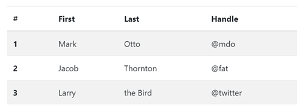
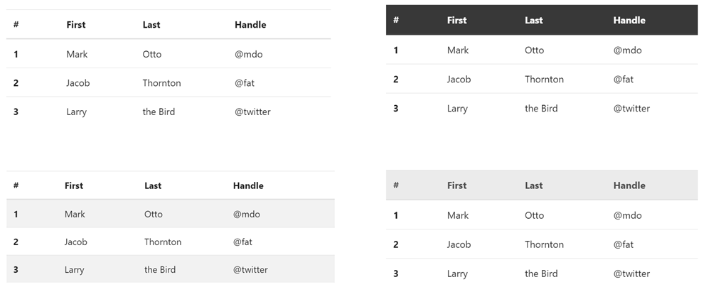
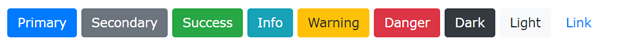

Bootstrap библиотека
====================

Једна од најбитнијих ствари у развоју било каквог софтвера су готове библиотеке, уз помоћ којих се лакше могу остварити различите функционалности. Библиотеке су битне и у веб-дизајну. Док будете правили веб-стране, вероватно ћете стилизовати компоненте као што су дугмад, листе, табеле итд. Пример *Bootstrap* табеле:

`Bootstrap <https://getbootstrap.com/>`_ је једна од бесплатних библиотека стилова које можете преузети и применити на сопственим *HTML* странма. Ова библиотека обезбеђује велики број готових стилова и *CSS* класа, које се могу користити без икаквог додатног дизајна, на пример:

- Унапред дефинисане *CSS* класе које стилизују стандардне *HTML* елементе као што су табеле, листе, слике, и слично. Помоћу *Bootstrap* библиотеке можемо да дефинишемо и мењамо стилове табела и тиме брзо и једноставно добијемо различите изгледе табела, попут ових на сликама:

|

- Унапред дефинисане *CSS* класе за боје позадине, на пример ``.bg-primary``, ``.bg-secondary``, ``.bg-success``, ``.bg-info``, ``.bg-warning``, ``.bg-danger``, ``.bg-dark`` i ``.bg-light``. Помоћу оваквих класа се лако могу направити различити стилови дугмади као што је приказано на следећој слици:

- Велики број готових компоненти као што су обрасци, галерије, табови, дугмад којa су професионално стилизованa и имају неопходне функционалности за развој веб корисничког интерфејса.
- Могућност да се лако распоређују елементи корисничког интерфејса на странама и да се распоред очува без обзира на тип прегледача или резолуцију која се користи за приказивање стране.

Коришћење *Bootstrap* библиотеке
--------------------------------

*Bootstrap* библиотеку можемо да користимо на два основна начина.

Јавно доступне локације
^^^^^^^^^^^^^^^^^^^^^^^

Први, једноставнији (и ефикаснији) начин је на јавно доступну верзију из *HTML* кôда наше стране, као што је приказано у следећем примеру:

.. activecode:: bootstrap_intro
    :language: html
    :nocodelens:

    <!DOCTYPE html>
    <html lang="en">
    <head>
      <title>Страна са укљученом Bootstrap библиотеком</title>
      <link href="https://cdn.jsdelivr.net/npm/bootstrap@5.2.0/dist/css/bootstrap.min.css" rel="stylesheet" crossorigin="anonymous">
    </head>
    <body>
    

      
Овде треба ставити садржај стране

    

    

    </body>
    </html>

У лекцијама о језику *CSS* је објашњено да се апсолутни линкови у  атрибуту ``src`` користе када је неки *CSS* стил јавно доступан и када желимо да га директно искористимо, уместо да га копирамо локално.

*Bootstrap* библиотека је постављена на јавне локације (или *CDN* локације – енгл. *CDN - Content Delivery Network*). Да би се користио `Bootstrap <https://getbootstrap.com/>`_, потребно је у ``<head>`` елемент стране убацити библиотеку стилова. Ако се користе неке напредне компоненте и анимације, потребно је убацити и додатну *JavaScript* библиотеку као што смо учинили у *HTML* кôду датом изнад.

Предност *CDN* локација је то што не морате да копирате све фајлове који би вам били потребни. Довољно је само да ставите ``<link>`` елемент ка локацији *CSS* фајла, као у претходном примеру. Мана оваквог приступа је то што вам је потребан приступ интернету чак и када отварате страну која је сачувана на вашем рачунару.

Библиотеке се временом ажурирају јер аутори додају нове функционалости, или поправљају грешке. Ажурна верзија не мора бити ``5.2.0`` која је коришћена у тренутку писања ових примера.

Ажурне линкове ка стиловима и *JavaScript* кôду можете наћи на *Bootstrap* сајту у одељку `CDN links <https://getbootstrap.com/docs/5.2/getting-started/introduction/#cdn-links>`_.

.. infonote::

    *HTML* кôд који је дат изнад је добра полазна тачка за вежбање и испробавање разних могућности библиотеке `Bootstrap`. Сачувајте овај кôд  у локалном фајлу са екстензијом `.html` и користите по једну нову копију тог фајла при сваком започињању новог примера или нове веб стране. Такође, ако користите сајтове `jsbin <https://jsbin.com/hayekosoqi/edit?html,output>`_ или `jsFiddle <https://jsfiddle.net/9n3cjm8w/>`_, примере започињите копирањем овог кода у прозор на сајту.

Преузимање *Bootstrap* библиотеке
^^^^^^^^^^^^^^^^^^^^^^^^^^^^^^^^^

Други начин употребе *Bootstrap* библиотеке је бесплатно преузимање запаковане `библиотеке <https://getbootstrap.com/docs/5.2/getting-started/download/>`_, распакивање библиокете и њено укључивање у *HTML* помоћу релативних линкова. Овакав начин рада може да буде погодан ако током креирања својих веб-страница немате сталан приступ интернету.

Ми ћемо у нашим примерима употребљавати *Bootstrap* библиотеку директно са јавних локација (без преузимања), подразумевајући сталан приступ интернету.
