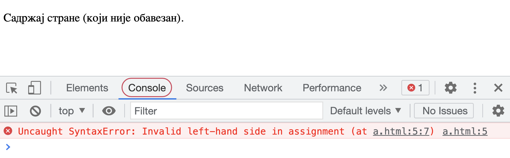

Извршавање *JavaScript* кôда
============================

Пре него што „заронимо“ у правила писања програма на језику *JavaScript*, погледајмо прво неколико начина на које можемо да извршавамо програме које будемо писали.

Приликом извршавања програма, наравно, желимо да видимо ефекат тог извршавања. То најчешће значи (бар у почетним примерима) да програм треба на неки начин да прикаже резултат свог рада. 

Приказивање податка
-------------------

Један начин приказивања податка, који функционише при свим начинима извршавања које ћемо користити јесте функција ``alert``. Оно што желимо да испишемо треба навести као агрумент ове функције:

.. code-block:: javascript

    alert('Zdravo');

Учитавање податка
-----------------

Програм врло често треба и да прихвати податке од корисника. У ту сврху ћемо користити функцију ``prompt``. Ова функција враћа текст који корисник унесе. Ако је потребно да од корисника прихватимо бројчани податак, можемо да користимо функције ``parseFloat`` и ``parseInt`` за претварање (конвертовање) текста у реалан, односно цео број. *JavaScript* интерпретер је довољно „паметан“ да често уме и сам да претвори стринг у број када је то потребно, па функције ``parseFloat`` и ``parseInt`` често нису неопходне, али је са њима програм чистији и јаснији. Употреба ових функција ће бити илустрована у примеру који следи, а који ћемо извршити на разне начине. У том примеру, програм прихвата од корисника два цела броја и исписује збир унетих бројева.

Извршавање *JavaScript* кôда у страницама овог курса
----------------------------------------------------

У уводном тексту смо већ видели прозор попут овога испод, у коме можемо да мењамо и извршавамо дате *JavaScript* програме. Програм се извршава кликом на дугме „Покрени програм“.

.. petlja-editor:: zbir_dva_broja_js

    main.js
    x = parseInt(prompt("x=?"));
    y = parseInt(prompt("y=?"));
    z = x + y;
    alert(z);
    ~~~
    index.html
    <!doctype html>
    <html>
    <head>
        
    </head>
    <body>
        
Садржај стране (који није обавезан).

    </body>
    </html>

Ово је веома згодан и удобан начин да брзо видимо како ради дати пример, или да на датом примеру испробамо малу модификацију. То, међутим, не значи да примере треба извршавати само у овом окружењу, напротив! Важно је да читаоци умеју да покрену своје програме и ван страница овог курса. Зато препоручујемо читаоцима да често пробају и друге начине извршавања својих *JavaScript* програма, а нарочито извршавање у оквиру сопственог (ма како малог и једноставног) веб-пројекта, као што је објашњено у наставку.

Извршавање *JavaScript* кôда на другим сајтовима
------------------------------------------------

Сајтове попут `<http://jsbin.com>`_, `<http://jsfiddle.net>`_ или `<http://js.do>`_ смо већ користили да испробамо функционисање *HTML* i *CSS* кôда. Показаћемо како можемо да извршимо *JavaScript* програм на првом од ових сајтова (извршавање на осталим сајтовима је врло слично).

Кликните на таб на коме пише „JavaScript“, затим унесите дате наредбе и на крају кликните на дугме „Run with JS“. Ови кораци су на слици означени црвеном бојом и нумерисани бројевима 1, 2 и 3.

|

Извршавање *JavaScript* кôда у вашим веб-странама
-------------------------------------------------

Основна идеја учења програмског језика *JavaScript* је да наше веб-стране учинимо динамичнијим. У складу са тиме, извршавање *JavaScript* програма у веб-странама је најважнији разлог за учење језика *JavaScript* и најчешћи начин употребе овог језика у пракси.

Поново наглашавамо да је извршавање *JavaScript* програма у оквиру страница овог курса или на специјализованим сајтовима само олакшица при учењу програмирања, јер су ти начини мало бржи и удобнији од покретања кроз сопствене веб-стране. Како је градиво у овом курсу веома усмерено ка практичном раду, подсећамо вас на препоруку да бар повремено покрећете *JavaScript* програме у оквиру својих веб-страна. Знања која усвојите и вештине које стекнете кроз овај курс највероватније ћете демонстрирати кроз мали веб пројекат, у коме ће *JavaScript* програми бити покретани у вашим веб-странама.

За овај начин рада потребан вам је било који програм за уређивање текста (едитор текста), као што је *Notepad*. Имајте на уму да постоји и велики број напредних едитора који су бесплатни за преузимање, а који су прилагођени писању кôда (на пример, *VSCode*, *Notepad++* или *Sublime*).

Погледајмо сада како можете да покренете *JavaScript* програм у вашој сопственој веб-страници. Прво направите на свом рачунару фајл *sabiranje.js* са овим садржајем:

.. code-block:: javascript

    x = parseInt(prompt('x=?'));
    y = parseInt(prompt('y=?'));
    z = x + y;
    alert(z);

Затим у истом директоријуму направите фајл *sabiranje.html* у коме ће се налазити овај *HTML* кôд:

.. code-block:: html

    <!DOCTYPE html>
    <html>
      <head>
        
      </head>
      <body>
        
Садржај стране (који није обавезан).

      </body>
    </html>

Убацивањем *HTML* елемента ``script`` смо веб-страни придружили екстерни фајл ``sabiranje.js`` који садржи *JavaScript* програм. Ово је слично као што смо до сада убацивањем елемента ``link`` са атрибутом ``rel="stylesheet.css"`` придруживали веб-страни екстерне *CSS* фајлове са дефинисаним стилом.

Сада отворите фајл *sabiranje.html* у веб-прегледачу, као што сте то и до сада радили. *JavaScript* програм ће бити извршен приликом отварања.

|

Постоји и могућност да *JavaScript* кôд сместимо директно у *HTML* елемент ``script``, уместо у засебан фајл. У том случају би фајл *sabiranje.html* изгледао овако:

.. petlja-editor:: zbir_dva_broja_html

    index.html
    <!DOCTYPE html>
    <html>
      <head>
        
      </head>
      <body>
        
Садржај стране (који није обавезан).

      </body>
    </html>

Овај фајл можете такође да направите на свом рачунару и да га отворите у веб-прегледачу. *JavaScript* програм ће и у овој варијанти бити извршен при отварању веб-документа.

~~~~

Поменимо на крају да овим није исцрпљен списак начина да се покрене *JavaScript* програм. Примера ради, *JavaScript* програми се могу покретати и из командног прозора, дакле без веб-прегледача. Ми се у оквиру овог курса нећемо бавити оваквим начином покретања *JavaScript* програма, зато што он није удобнији од већ поменутих начина, а могуће области примене оваквог поступка превазилазе оквире овог курса. Заинтересовани читаоци могу пронаћи више информација на сајту *W3Schools* у делу под именом `node.js <https://www.w3schools.com/nodejs>`_.

Грешке у програму
-----------------

Као и сваки програмски језик, *JavaScript* има своју синтаксу, то јест правила писања појединих наредби и целог програма. Када неки део програма није написан по правилима језика, то је **синтаксна грешка**. На пример, у следећем програму запис ``3 = a;`` је неисправна наредба, што значи да у програму имамо синтаксну грешку.

.. code-block:: javascript

    3 = a;
    alert('Здраво!');

Порука о грешци се појављује када покрећемо програм у оквиру веб-стране, мада није одмах видљива. Направите на свом рачунару *HTML* фајл са следећим садржајем (ми смо наш фајл назвали ``a.html``):

.. petlja-editor:: sintaksna_greska_html

    index.html
    <!DOCTYPE html>
    <html>
      <head>
        
      </head>
      <body>
        
Садржај стране (који није обавезан).

      </body>
    </html>

Када прегледачем отворимо веб-страну са програмом за који сумњамо да је синтаксно неисправан, треба да отворимо у прегледачу додатни прозор са алатом за развој (енгл. *developer tools window*), у коме се појављују разне додатне информације. Код већине прегледача то се постиже притиском тастера *F12* или *Ctrl+Shift+I*, или кроз мени (дугме ``⋮``, или ``…``, или ``≡`` горе десно, опција *Tools/Developer Tools* или слично). Када изаберемо таб са натписом *Console* (конзола, означен на слици), видећемо и поруке о могућим синтаксним грешкама:

На крају поруке о грешци стоји ``a.html:5``, што значи да грешка настаје извршавањем линије 5 у фајлу ``a.html``. Ове информације нам помажу да разумемо зашто је програм неисправан и шта треба да радимо да бисмо отклонили грешке.

**Баг** (буба) је грешка која не спречава програм да се изврши, али он не ради онако како очекујемо. То значи да је програм написан по правилима језика (синтаксно је исправан), али тим програмом нисмо рекли рачунару да ради оно што смо намеравали, већ нешто друго (програм је семантички неисправан). Овакве грешке је теже открити, јер не добијамо никакве поруке о томе шта може да буде погрешно. Примери багова су исписивање вредности друге променљиве (а не оне која нас интересује), употреба погрешне операције (на пример ``+`` уместо ``-``), итд.

При откривању багова (дебаговању) можемо да убацимо у програм додатне позиве функције ``alert``, која ће нам помоћи да пратимо вредности у програму и редослед извршавања наредби. Након што откријемо баг, ове додатне позиве функције ``alert`` треба уклонити из програма.

Пробајте да пронађете баг у следећем примеру који треба да испише производ бројева од 1 до 10. Очекиван резултат је 3628800.

.. petlja-editor:: js_bag

    main.js
    let proizvod = 0;
    for (let i = 1; i < 10; i++) {
        proizvod = proizvod * i;
    }

    alert('Производ бројева 1..10 је ' + proizvod);
    ~~~
    index.html
    <!DOCTYPE html>
    <html>
      <head>
        
      </head>
      <body>
        
Садржај стране (који није обавезан).

      </body>
    </html>

Када дебагујемо програм, можемо да користимо наредбу која исписује текст у конзолу, тј. у исти простор у коме нам веб-прегледач приказује поруке о грешкама у програму. То постижемо користећи позив методе ``console.log``.

.. petlja-editor:: js_bag_consolelog

    main.js
    let proizvod = 0;
    for (let i = 1; i < 10; i++) {
        proizvod = proizvod * i;
        console.log('i = ' + i + ', proizvod = ' + proizvod);
    }

    console.log('Производ бројева 1..10 је ' + proizvod);
    ~~~
    index.html
    <!DOCTYPE html>
    <html>
      <head>
        
      </head>
      <body>
        
Садржај стране (који није обавезан).

      </body>
    </html>

У веб-прегледачу притисните тастер *F12* (*Chrome*) да бисте видели конзолу.

