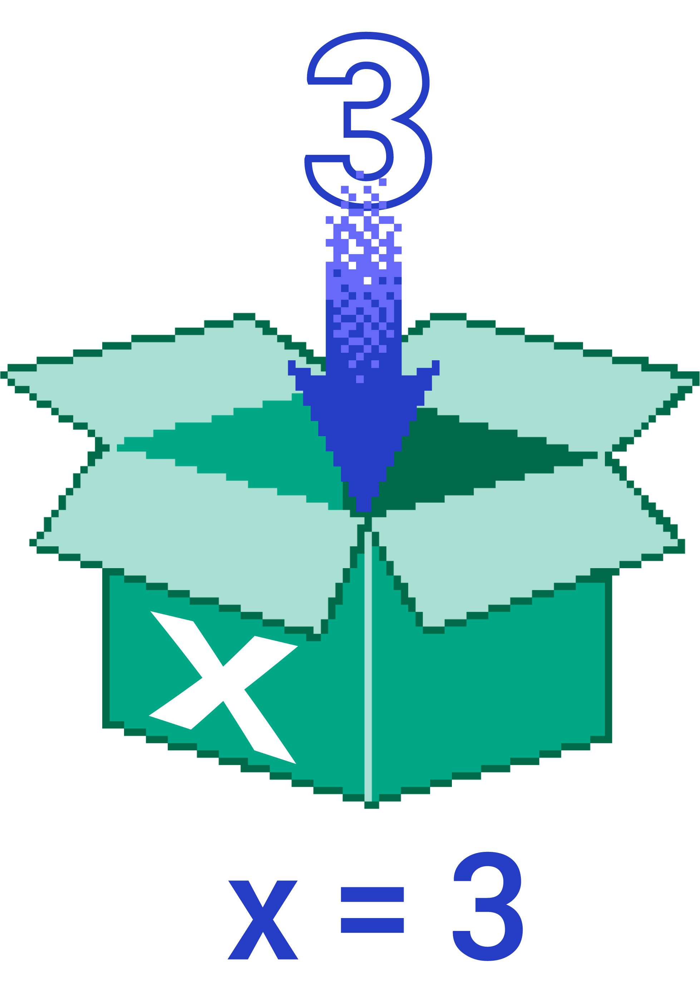

Променљиве
==========

Као што знамо, променљива је именовани простор у меморији рачунара у коме се чува нека вредност. Променљиву можемо да замислимо као кутију у којој чувамо неку вредност.

Садржај променљиве мењамо додељивањем вредности променљивој, што можемо чинити више пута програму, у складу са алгоритмом који програмирамо. Променљивој се додељује вредност тако што напишемо име променљиве, затим знак ``=`` и на крају вредност. Следећа слика илуструје значење наредбе ``x=3`` (променљивој *x* додељујемо вредност 3).

Вредност коју смо доделили променљивој можемо касније да употребимо за израчунавање нових вредности, а можемо и да је на неки начин прикажемо као резултат (на пример, користећи функцију ``alert`` или ``console.log``, а ускоро ћемо видети и друге начине).

Погледајмо сада још неке детаље у вези са употребом променљивих у *JavaScript* програмима.

Декларација
-----------

Декларацијом променљиве се најављује њена употреба у наставку програма и одређује се у ком делу програма се та променљива може користити. 

.. infonote::

    У језику *JavaScript* декларацију променљивих ``x``, ``y``, ``z`` треба писати овако:

    .. code-block:: javascript

        let x, y, z;

Старији начин декларисања је писање речи ``var`` уместо ``let``, а могуће је и потпуно изоставити декларацију (што је скоро исто као да смо је декларисали користећи реч ``var``). Мада разлике у значењу декларација са ``let`` и ``var`` нису велике, боље је декларисати променљиве помоћу речи ``let``, јер то може да помогне да у сложенијим програмима избегнемо неке необичне и често неочекиване и збуњујуће ефекте. 

Употреба речи ``let`` у декларацијама нас форсира да пишемо јасније програме и помаже нам да не правимо багове. Конкретније, неке грешке које направимо пишући програм без декларација (или са старијим декларацијама помоћу речи ``var``) су багови, тј. такве да програм може да се изврши, али се добија погрешан резултат. Када у декларацијама истог програма користимо реч ``let``, програм може да постане синтаксно неисправан, или да пукне при извршавању. Ово је боље, јер о таквим грешкама добијамо поруке, па их и лакше исправљамо.
    
У разним примерима на интернету и по књигама, видећете да је употреба речи ``var`` при декларацијама променљивих прилично честа. То је, нажалост, највећим делом наслеђе из времена када у језику *JavaScript* још није постојала декларација помоћу речи ``let``.

Иницијализација
---------------

Често се променљивој одмах при декларацији додељује и почетна вредност. На пример, уместо:

.. activecode:: let_i_poc_vrednost1_js
    :language: javascript
    :nocodelens:

    let x, y, z;
    x = parseInt(prompt('x=?'));
    y = parseInt(prompt('y=?'));
    z = x + y;
    alert(z);

можемо да пишемо:

.. activecode:: let_i_poc_vrednost2_js
    :language: javascript
    :nocodelens:

    let x = parseInt(prompt('x=?'));
    let y = parseInt(prompt('y=?'));
    let z = x + y;
    alert(z);

Додељивање почетне вредности променљивој назива се **иницијализација**. Препоручује се да променљиве иницијализујемо одмах при декларацији кад год то логика програма допушта.

Константе
---------

Понекад је у програмима иницијализација променљиве једино додељивање вредности тој променљивој. Када не намеравамо да мењамо вредност променљиве у наставку програма, добро је у декларацији уместо речи ``let`` писати реч ``const``.

.. activecode:: let_i_poc_vrednost3_js
    :language: javascript
    :nocodelens:

    const x = parseInt(prompt('x=?'));
    const y = parseInt(prompt('y=?'));
    const z = x + y;
    alert(z);

Тиме програм додатно постаје јаснији за читање, а неки теже ухватљиви багови се могу претворити у грешке у току извршавања (енгл. *runtime errors*, пуцање програма). Као што је раније речено, ако већ имамо грешке у програму, онда је боље да су то грешке о којима добијамо поруку (као што су синтаксне грешке и пуцање програма), јер ћемо уз помоћ тих порука грешке лакше исправити.

Типови
------

Вредности које додељујемо променљивама у програмима су подаци који се уносе у програм, чувају у фајловима, комбинују приликом рачунања израза и на крају на неки начин приказују. Те вредности могу бити разних врста, тј. могу припадати различитим типовима. Типови вредности који се најчешће користе су *number*, *boolean* и *string* и о њима ће бити речи у наставку.
