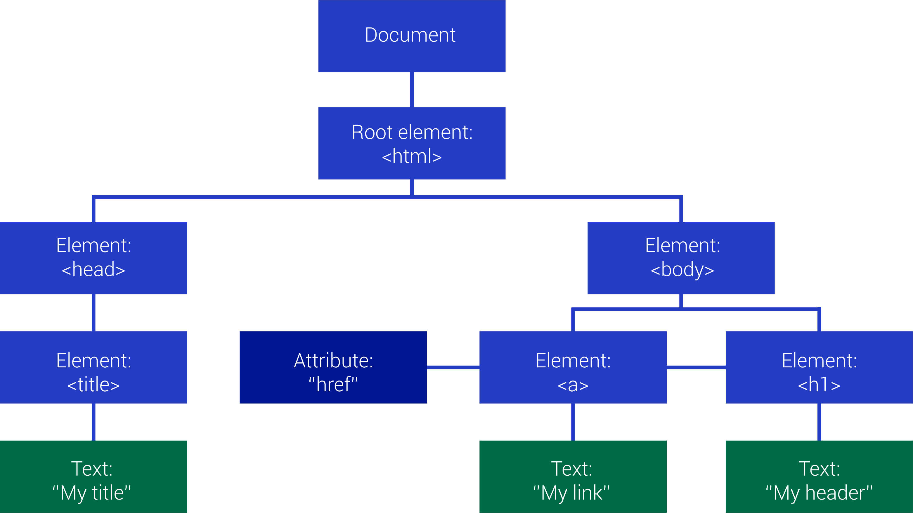

Објектни модел документа стране
===============================

У лекцијама о језику *HTML* смо видели да *HTML* кôд дефинише структуру стране у којој се налази заглавље са насловима и тело са различитим *HTML* елементима. 

У *JavaScript* кôду који се извршава у веб-странама се може користити један специјалан објекат који се зове *document*. Овај објекат нам омогућава да приступимо *HTML* елементима који се налазе у веб-страни и да их читамо и мењамо. Када лоцирамо неки објекат, који представља неки *HTML* елемент у страни, можемо да га променимо тако што му на пример променимо *CSS* стил.

.. petlja-editor:: boja_teksta_html_js

    main.js
    document.title = 'Ово је наслов стране';
    let body = document.body;
    // CSS својство background-color (боја позадине)
    body.style.backgroundColor = 'black';
    // CSS својство color (боја текста)
    body.style.color = 'lightgreen';

    let boja = document.body.style.color;
    alert(`Bоја текста у страни је "${boja}".`);
    ~~~
    index.html
    <!DOCTYPE html>
    <html>
      <head>
      </head>
      <body>
        
Боја слова и позадине овог текста је постављена JavaScript наредбом.

        
      </body>
    </html>

Хијерархија објеката која почиње од документа стране назива се **објектни модел документа** (енгл. *document object model*, скраћено *DOM*). Из *JavaScript* програма можемо да дохватимо сваки елемент стране, да убацујемо и избацујемо елементе, да их допуњујемо и мењамо на различите начине. Следећи пример показује један начин како можемо да дохватимо поједине елементе у хијерархији документа и да тим елементима задамо нови стил.

За сада ћемо употребити својства ``firstElementChild`` за дохватање првог „детета“ и ``nextElementSibling`` за дохватање следећег елемента у истом нивоу хијерархије (следећи „брат“ или „сестра“). Ова два својства *DOM* објеката су довољна за дохватање било ког елемента, а ускоро ћемо упознати и удобније начине за манипулисање *DOM* објектима.

Елементима који имају идентификатор можемо приступити помоћу објекта ``window``. У наредном примеру имамо елемент са идентификатором ``navigacija`` и он ће бити доступан као својство ``window`` објекта, нпр. ``window.navigacija``. Ово није препоручен начин приступа елементима са идентификатором али послужиће док не научимо неке напредне методе у наредним лекцијама.

.. petlja-editor:: DOM_hijerarhija_html_js_1

    main.js
    // елемент div са идентификатором navigacija
    let navigacija = window.navigacija;

    // први линк: firstElementChild селектује први елемент у навигацији
    let prviLink = navigacija.firstElementChild;
    prviLink.style.backgroundColor = 'red';
    prviLink.style.color = 'white';

    // други линк: nextElementSibling селектује следећи елемент
    // у истом нивоу хијерархије
    let drugiLink = prviLink.nextElementSibling;
    drugiLink.style.backgroundColor = 'lime';

    // трећи линк: nextElementSibling селектује следећи елемент
    // у истом нивоу хијерархије
    let treciLink = drugiLink.nextElementSibling;
    treciLink.style.backgroundColor = 'skyblue';
    ~~~
    index.html
    <!DOCTYPE html>
    <html>
    <head>
        <meta charset="utf-8"/>
    </head>
    <body>
        

            <a href="https://google.com">Први линк</a>
            <a href="https://google.com">Други линк</a>
            <a href="https://google.com">Трећи линк</a>
        

        
    </body>
    </html>

