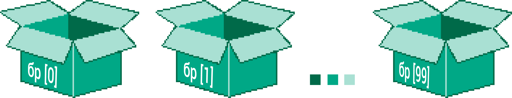

Низови
======

Низ је сложена променљива која (као и објекат) садржи више других променљивих у себи. Свака променљива у низу има свој редни број (или индекс, како ћемо га звати у наставку) помоћу ког се може наћи вредност која нам треба.

Као што променљиве можемо да замислимо као кутије у којима се налазе вредности, низове можемо да замислимо као групе кутија где свака кутија има свој редни број (или индекс). Следећа слика дочарава низ који се зове ``br`` и (тренутно) има 100 елемената:

Свакој појединачној променљивој у низу (зваћемо их елементи низа) можемо приступити по њеном редном броју тј. индексу и у њу се може или убацити нека вредност или прочитати вредност из ње. 
Треба имати на уму да **ПРВИ** елемент у низу има индекс **0** – ово правило је карактеристично за већину програмских језика. Ако имамо променљиву која се зове ``br`` и представља низ, онда можемо да дођемо до елемената у том низу тако што иза имена низа ставимо угласте заграде и у њих редни број.

Иницијализација низа
--------------------

Низ се прави тако што се унутар угластих заграда наведу вредности које ће бити уписане у елементе низа:

.. petlja-editor:: niz_literal_js

    main.js
    let a = [10, 8, 26, 5, 3, 12];
    alert(`a = ${a}`);
    ~~~
    index.html
    <!DOCTYPE html>
    <html>
      <head>
        
      </head>
      <body>
        
Садржај стране (који није обавезан).

      </body>
    </html>

Број елемената низа добијамо кроз својство ``length``, на пример:

.. petlja-editor:: niz_duzina_js

    main.js
    let a = [10, 8, 26, 5, 3, 12];
    alert(`a.length = ${a.length}`);
    ~~~
    index.html
    <!DOCTYPE html>
    <html>
      <head>
        
      </head>
      <body>
        
Садржај стране (који није обавезан).

      </body>
    </html>

Додавање елемената
------------------

У следећем примеру ћемо полазећи од празног низа, у елементе са редним бројевима 0, 1 и 2 уписати неке вредности, а онда ћемо прочитати вредности из тих елемената, да бисмо их сабрали и приказали збир:

.. petlja-editor:: niz_bir_elemenata_js

    main.js
    let br = [];
    br[0] = 10;
    br[1] = 3;
    br[2] = 200;
    zbir = br[0] + br[1] + br[2];
    alert(`zbir = ${zbir}`);
    ~~~
    index.html
    <!DOCTYPE html>
    <html>
      <head>
        
      </head>
      <body>
        
Садржај стране (који није обавезан).

      </body>
    </html>

У неким језицима је приликом дефинисања низа потребно навести његову дужину (тј. колико ће имати елемената). У Јаваскрипту ово није потребно – сваки пут када покушате да упишете неку вредност у елемент низа са неким индексом, низ ће аутоматски бити проширен ако је то потребно, тако да има довољан број елемената. Ова особина *JavaScript* низова је илустрована у следећем примеру:

.. petlja-editor:: prosirivanje_niza_js

    main.js
    let a = [];
    alert(`Број елемената у низу [${a}] је ${a.length}.`);
    a[0] = 4;
    a[1] = 5;
    alert(`Број елемената у низу [${a}] је ${a.length}.`);
    a[7] = 91;
    alert(`Број елемената у низу [${a}] је ${a.length}.`);
    alert(`a[3] = ${a[3]}`);
    ~~~
    index.html
    <!DOCTYPE html>
    <html>
      <head>
        
      </head>
      <body>
        
Садржај стране (који није обавезан).

      </body>
    </html>

Приметимо да елементи којима није додељена вредност (на пример ``a[3]``) имају вредност ``undefined``.

Из претходног је јасно да наредбом ``a[a.length] = x;`` можемо на крај низа да додамо нови елемент, без убацивања недефинисаних елемената.

За убацивање елемената се ипак чешће користи наредба ``a.push(x);``, која има исти ефекат, а на коју ћемо се ускоро поново осврнути каде буде речи о методама:

.. petlja-editor:: dodavanje_na_kraj_niza_js

    main.js
    let a = [];
    a[a.length] = 5;
    a[a.length] = 10;
    alert(`a = ${a}`);
    a.push(15);
    a.push(20);
    alert(`a = ${a}`);
    ~~~
    index.html
    <!DOCTYPE html>
    <html>
      <head>
        
      </head>
      <body>
        
Садржај стране (који није обавезан).

      </body>
    </html>

JSON приказ
-----------

У лекцији `Објекти - Објекат као стринг <./03a_js_objekti_citanje.html#id3>`_, показали смо ``JSON.stringify`` и ``JSON.parse`` за конверзију објекта у *JSON*. Исте методе се могу применити и на низове. У случају да користимо ``JSON.stringify``, низ ће бити исписан са угластим заградама око елемената:

.. petlja-editor:: json_konverzija_niza_js

    main.js
    let a = [2, 3, 4];
    let s = JSON.stringify(a);
    alert(`a = ${a}`); // bez zagrada
    alert(`s = ${s}`); // sa zagradama
    let b = JSON.parse(s); // iz stringa u niz
    alert(`b[1] = ${b[1]}`);
    ~~~
    index.html
    <!DOCTYPE html>
    <html>
      <head>
        
      </head>
      <body>
        
Садржај стране (који није обавезан).

      </body>
    </html>

Низови и објектни модел документа
---------------------------------

У лекцији о објектима смо се упознали са објектом ``document``, помоћу којег можемо да приступимо елементима стране. У претходним примерима смо видели како да искористимо овај објекат да променимо стил неког елемента.

Сваки *HTML* елемент, укључујући објекат ``document.body`` садржи у себи и низ ``children``, који представља низ елемената смештених у тело стране. Употребом низа ``children`` можемо да избегнемо употребу својстава ``firstElementChild`` и ``nextElementSibling``. Тако би пример „Дохватање елемената кроз *DOM*“ могао да се напише и овако:

**Пример – дохватање елемената кроз DOM помоћу низова**

.. petlja-editor:: DOM_nizovi_html_js

    main.js
    let odeljci = document.body.children;
    odeljci[1].style.backgroundColor = '#C0FFFF';
    odeljci[1].style.color = 'blue';
    odeljci[1].style.fontSize = "16pt";

    odeljci[2].style.backgroundColor = '#FFFFC0';
    odeljci[2].style.color = 'brown';

    let odeljak3Paragrafi = odeljci[2].children;
    odeljak3Paragrafi[1].style.color = 'red';
    odeljak3Paragrafi[1].style.border = "1px solid red";
    ~~~
    index.html
    <!DOCTYPE html>
    <html>
      <head>
      </head>
      <body>
        

          
Овај документ има четири одељка.

          
Ово је други параграф првог одељка.

        

        

          
Ово је други одељак.

          
Стил другог и трећег одељка је подешен програмски.

        

        

          
Ово је трећи одељак.

          
У трећем одељку други параграф је посебно стилизован.

          
У осталим деловима трећег одељка примењује се стил одељка.

        

        

          
Четврти одељак изгледа као и први.

          
Њихов стил није програмски мењан.

        

        
      </body>
    </html>

Осим низа ``children`` који постоји у разним објектима, објекат ``document`` има и низове попут ``images``, ``anchors`` и ``scripts``, који нам омогућавају да добијемо низове који садрже све слике, све линкове или све скриптове који се налазе у *HTML* документу.

У следећем примеру можете видети како да одредите колико слика има у страни, да дохватите те слике и да урадите нешто са њима, као што је промена величине. Ако желите да направите свој *HTML* фајл, преузмите и ове три слике:

.. image:: ../../_images/js/emo1.png
    :width: 100px
.. image:: ../../_images/js/emo2.png
    :width: 100px
.. image:: ../../_images/js/emo3.png
    :width: 100px

**Пример – постављање величине слика**

.. petlja-editor:: DOM_nizovi_vel_slika_html_js

    main.js
    let slike = document.images;
    alert(`У документу има ${slike.length} слике/слика.` )
    slike[0].style.width = '50px';
    slike[0].style.height = '50px';
    slike[2].style.width = '75px';
    slike[2].style.height = '75px';
    ~~~
    index.html
    <!DOCTYPE html>
    <html lang="sr">
      <head>
        <title>Слике</title>
      </head>
      <body>
        <h2>Задавање величине слика</h2>
           
        
        
        

        
 Величине прве и последње слике су задате програмски. 

        
      </body>
    </html>

.. activecode:: DOM_nizovi_vel_slika_html_js
    :language: html
    :nocodelens:

    <!DOCTYPE html>
    <html lang="sr">
      <head>
        <title>Слике</title>
      </head>
      <body>
        <h2>Задавање величине слика</h2>

        
        
        

        
 Величине прве и последње слике су задате програмски. 

        
      </body>
    </html>
