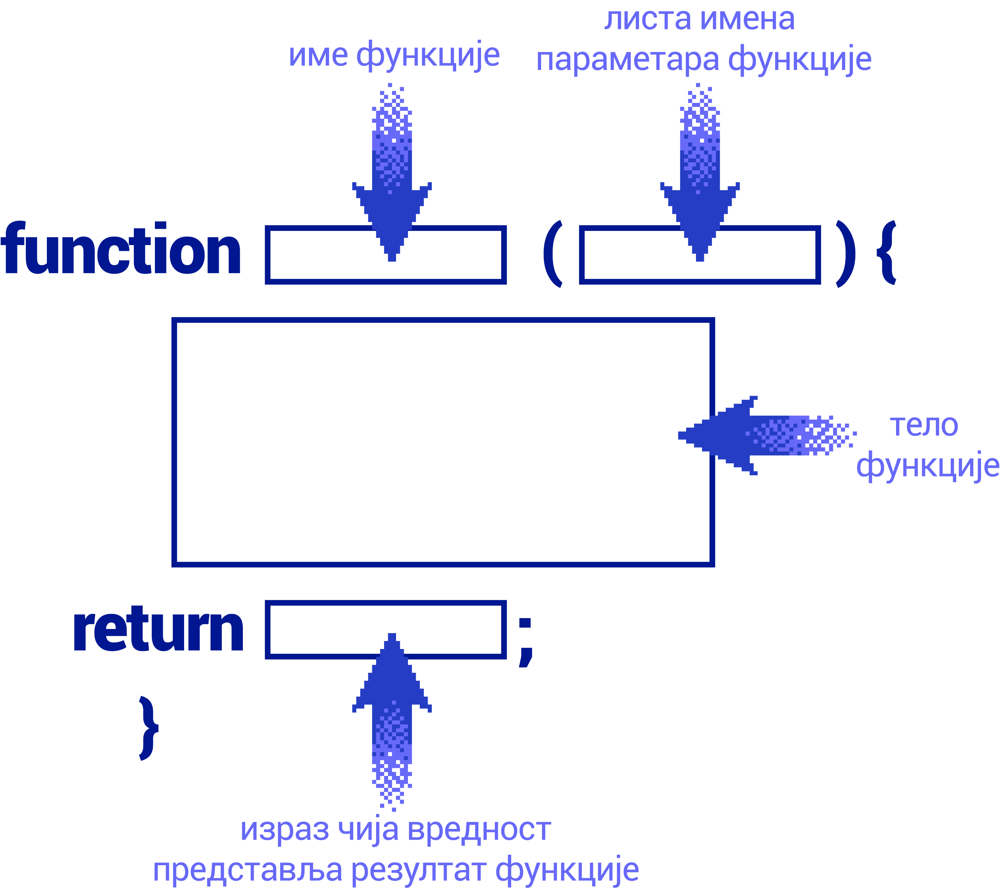
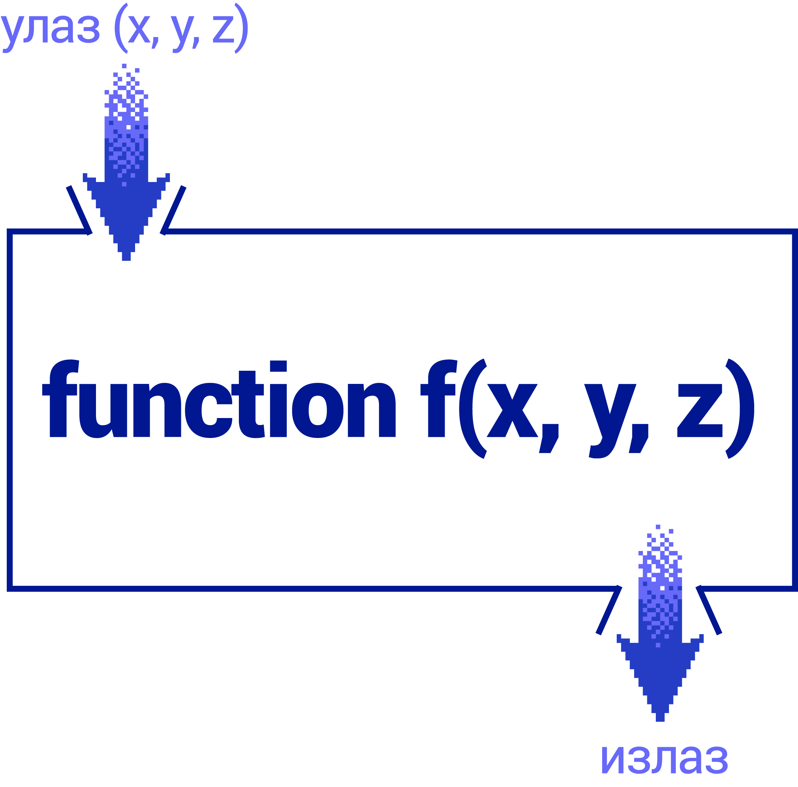

Функције
========

У програмима који решавају сложеније проблеме, групу наредби које решавају неки подзадатак можемо да издвојимо у целину која се зове функција. Функција има своје име и позивом функције по имену се извршавају наредбе у тој функцији.

У језику *JavaScript* се функције креирају тако што се иза имена функције у облим заградама наведе листа параметара, а затим у витичастим заградама скуп наредби које треба извршити када се та функција позове.

Параметри су вредности које можемо да пошаљемо функцији када је позовемо. Функција на основу параметара може (а не мора) да врати неки резултат помоћу наредбе ``return``.

.. petlja-editor:: pitagorina_teorema_js

    main.js
    function izracunajHipotenuzu(a, b) {
        const hipotenuza = Math.sqrt(a ** 2 + b ** 2);
        return hipotenuza;
    }

    // дати подаци
    const a = 3;
    const b = 4;
    const c = izracunajHipotenuzu(a, b);
    alert(`Хипотенуза троугла са страницама a=${a} b=${b} је: ${c}`);
    ~~~
    index.html
    <!DOCTYPE html>
    <html>
      <head>
        
      </head>
      <body>
        
Садржај стране (који није обавезан).

      </body>
    </html>

Функција се зове ``izracunajHipotenuzu`` и прима два параметра ``a`` и ``b``. Тело функције рачуна хипотенузу на основу параметара и враћа вредност коришћењем наредбе ``return``.

.. questionnote::

    **Пример  – сложено кретање 1**
    
    Позната је брзина тела у појединим тренуцима:

    - у тренутку :math:`t_0 = 0s`, брзина је била :math:`V_0 = 2{m \over s}`
    - у тренутку :math:`t_1 = 4s`, брзина је била :math:`V_1 = 11{m \over s}`
    - у тренутку :math:`t_2 = 11s`, брзина је била :math:`V_2 = 13{m \over s}`
    - у тренутку :math:`t_3 = 14s`, брзина је била :math:`V_3 = 5{m \over s}`

    Написати програм који израчунава дужину пута коју је ово тело прешло, претпостављајући да се брзина између контролних тачака мењала равномерно.

Уз нешто знања физике не би требало да буде тешко да се разуме дато решење:

.. petlja-editor:: slozeno_kretanje_1_js

    main.js
    /*
     * Рачуна пређени пут на основу параметара.
     * @param {number} tPoc - почетно време
     * @param {number} tZav - завршно време
     * @param {number} vPoc - почетна брзина
     * @param {number} vZav - завршна брзина
     * @returns {number} Пређени пут
     */
    function put(tPoc, tZav, vPoc, vZav) {
        // време преласка за које рачунамо пут
        const t = tZav - tPoc;
        // средња брзина између две тачке
        const vsr = (vPoc + vZav) / 2;
        // пут = средња брзина * време између две тачке
        const predjeniPut = vsr * t;
        return predjeniPut;
    }

    // дати подаци
    const t0 = 0, t1 = 4, t2 = 11, t3 = 14;
    const v0 = 2, v1 = 11, v2 = 13, v3 = 5;

    const s1 = put(t0, t1, v0, v1);
    const s2 = put(t1, t2, v1, v2);
    const s3 = put(t2, t3, v2, v3);
    const ukupno = s1 + s2 + s3;
    alert(`Укупан пређени пут је ${ukupno.toFixed(2)}.`);
    ~~~
    index.html
    <!DOCTYPE html>
    <html>
      <head>
        
      </head>
      <body>
        
Садржај стране (који није обавезан).

      </body>
    </html>

Када је потребно да функција врати више од једног резултата, те резултате можемо да наведемо у угластим заградама (као низ). Променљиве које примају враћене вредности на месту позива функције такође наводимо у угластим заградама.

.. questionnote::

    **Пример – сложено кретање 2**
    
    Тело које је на почетку у мировању, креће се све време у истом смеру на следећи начин:

    - најпре 3 секунде равномерно убрзава убрзањем од :math:`2{m \over s^2}`;
    - затим се креће сталном брзином током наредних 10 секунди;
    - на крају равномерно успорава убрзањем од :math:`-6{m \over s^2}` до заустављања.
    
    Написати програм који израчунава дужину пута коју је ово тело прешло.

.. petlja-editor:: slozeno_kretanje_2_js

    main.js
    /*
     * Рачуна пређени пут и завршну брзину на основу параметара.
     * @param {number} t - време путовања
     * @param {number} vpoc - почетна брзина
     * @param {number} a - убрзање
     * @returns {array} Пређени пут и завршна брзина
     */
    function putIZavrsnaBrzina(t, vpoc, a) {
        // брзина после t секунди (завршна)
        const vzav = vpoc + a * t;
        // средња брзина
        const vsr = (vpoc + vzav) / 2;
        // пређени пут
        const put = vsr * t;
        // резултат је низ са 2 елемента
        return [put, vzav];
    }

    // дати подаци
    const a01 = 2, a12 = 0, a23 = -6;
    const t01 = 3, t12 = 10;
    const v0 = 0;

    const [s1, v1] = putIZavrsnaBrzina(t01, v0, a01);
    const [s2, v2] = putIZavrsnaBrzina(t12, v1, a12);
    const t23 = v2 / Math.abs(a23);
    const [s3, v3] = putIZavrsnaBrzina(t23, v2, a23);
    const ukupno = s1 + s2 + s3;
    alert(`Укупан пређени пут је ${ukupno.toFixed(2)}.`);
    ~~~
    index.html
    <!DOCTYPE html>
    <html>
      <head>
        
      </head>
      <body>
        
Садржај стране (који није обавезан).

      </body>
    </html>

|
    
Функције у претходним примерима на основу датих параметара израчунавају неки резултат и враћају га на место позива:

Функција, међутим, може да буде и без параметара, а у том случају се после имена функције пишу само обле заграде. Такође, функција не мора ни да врати резултат. У следећем примеру се појављује функција која нема параметре и не враћа резултат (функције које не враћају резултат се понекад називају процедуре).

.. questionnote::

    **Пример – време отварања веб-странице**
    
    Направити веб-страницу, која по отварању јавља у колико сати је отворена.

Једно могуће решење је:

.. petlja-editor:: tacno_vreme_js

    main.js
    function prikaziTacnoVreme() {
      const sada = new Date();
      alert(`Страница је отворена у ${sada.toLocaleTimeString()} сати.`);
    }

    prikaziTacnoVreme();
    ~~~
    index.html
    <!DOCTYPE html>
    <html>
      <head>
        
      </head>
      <body>
        
Садржај стране (који није обавезан).

      </body>
    </html>

.. questionnote::

    **Вежба – приказивање датума**

    Изменити претходни пример да се поред времена испише и датум отварања странице.

У случају да функција нема у себи наредбу ``return``, или ако би у њој писало само ``return;`` без вредности која се враћа, позив функције пишемо као наредбу:

.. code-block:: javascript

    prikaziTacnoVreme();

Ако бисмо „вредност“ такве функције грешком доделили некој променљивој...

.. code-block:: javascript

    let x = prikaziTacnoVreme();

... променљива ``x`` би добила вредност ``undefined``.
