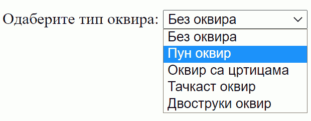

Листе за одабир вредности
=========================

Често је потребно да се направи кориснички интерфејс у коме ће корисник да одабере неку од унапред дефинисаних вредности. На пример, у лекцијама о *CSS* правилима смо видели да ивица елемената може да буде нека од унапред дефинисаних вредности као што је пун (``solid``),
тачкаст (``dotted``), двоструки (``double``) и слично. Уместо да корисник уноси имена ових стилова, боље је припремити листу могућих вредности тако да одабере једну од њих, као што је приказано у следећој слици:

*HTML* елемент ``<select>`` нам омогућава да наведемо опције које корисник може да одабере:

.. code-block:: html

      <label for="оквир">Одаберите тип оквира:</label>
      <select id="оквир" name="border" onchange="izabranOkvir()">
        <option value="none">Без оквира</option>
        <option value="solid">Пун оквир</option>
        <option value="dashed">Оквир са цртицама</option>
        <option value="dotted">Тачкаст оквир</option>
        <option value="double">Двоструки оквир</option>
      </select>

Елементу ``<select>`` обично претходи један *HTML* елемент ``<label>``, у коме објашњавамо намену елемента ``<select>``. Да би ова два елемента била правилно позиционирана, атрибут ``for`` елемента ``<label>`` треба да буде једнак атрибуту ``id`` елемента ``<select>``.

Овде смо догађај ``change`` елемента ``<select>`` повезали са функцијом која реагује на промену избора. Ово не морамо (не треба) да радимо када је елемент ``<select>`` део формулара, јер се тада акција обично покреће након свих избора притском на одговарајуће дугме.

Дајемо и комплетан пример који можете да извршите. Сваким избором из листе се покреће анонимна *JavaScript* функција, у којој се проналази елемент ``<select>`` по идентификатору (``оквир``), чита се вредност из тренутно одабране ставке листе и онда се та вредност уписује као стил оквира елемента чији идентификатор је ``омот``.

.. activecode:: izbor_okvira_iz_liste_html_js
    :language: html
    :nocodelens:

    <!DOCTYPE html>
    <html lang="en">
        <head>
            <title>Избор из листе</title>
        </head>
        <body>
            <h2>Пример употребе елемента &lt;select&gt;</h2>
           
            

              

                Избором елемента из листе покреће се функција izabranOkvir(),
                која подешава тип оквира око текста испод наслова и поља за избор.
              

              <label for="оквир">Одаберите тип оквира:</label>
              <select id="оквир" name="border">
                <option value="none">Без оквира</option>
                <option value="solid">Пун оквир</option>
                <option value="dashed">Оквир са цртицама</option>
                <option value="dotted">Тачкаст оквир</option>
                <option value="double">Двоструки оквир</option>
              </select>
            

         </body>
        
    </html>
    

.. questionnote::

    **Вежба - избор боје**

    Направите веб страну са листом за избор боје, слично претходном примеру. Додајте функцију која ће прочитати тренутно одабрану вредност и поставити боју позадине за параграф (пасус).

.. comment

    Twitter Bootstrap листе
    -----------------------

    *Twitter Bootstrap* стилови вам омогућавају да ваша листа буде лепше стилизована уз практично исту количину кода.

    .. image:: ../../_images/js/bootstrap_lista.png
        :width: 500px
        :align: center

    *HTML* кôд којим се креира оваква листа је приказан у следећем примеру.

    .. code-block:: html

        

          <button class="btn btn-secondary dropdown-toggle" type="button" id="border" data-toggle="dropdown">
            Одаберите стил ивице:
          </button>
          

            <button class="dropdown-item" onclick="postavi('solid')">Пуна</button>
            <button class="dropdown-item" onclick="postavi('solid')">Пуна</button>
            <button class="dropdown-item" onclick="postavi('dashed')">Испрекидана</button>
            <button class="dropdown-item" onclick="postavi('dotted')">Тачкаста</button>
            

            <button class="dropdown-item" onclick="postavi('double')">Двострука</button>
          

        

    Листа се ставља у ``
`` елемент који има класу ``dropdown``. Унутар овог елемента се налази једно дугме са класом ``dropdown-toggle`` на које се може кликнути како би се приказале остале опције. Унутар овог дугмета је и текст који ће бити приказан док опције нису приказане. Листа нема опције као у случају класичне *HTML* листе. Уместо тога, ова листа садржи ``
`` блок са класом ``dropdown-menu`` у коме се налази скуп дугмади која ће бити приказана као ставке листе. Овакво дугме мора да има класу ``dropdown-item`` и у његовом атрибуту ``onclick`` се може позвати нека функција која ће се извршити када се одабере нека ставка (као и у случају стандардне дугмади). У овом случају, при избору било које од ставки позива се *JavaScript* функција ``postavi``, којој се као параметар прослеђује одговарајућа вредност врсте ивице.

    Поред дугмади, као ставке се могу користити и линкови (елементи ``<а>``), а у случају да се као нека ставка стави ``
`` блок са класом ``dropdown-divider``, на његовом месту ће се поставити линија која дели ставке. Постоји још много начина на које можете стилизовати ставке листе. На пример, можете да дефинишете да се опције приказују увек са леве или десне стране. Више информација о могућностима стилизовања листа можете наћи у *bootstrap* документацији о 
    `листама за избор <https://getbootstrap.com/docs/4.5/components/dropdowns/>`_ .

    Функција која би реаговала на ове догађаје изгледа као функција у следећем примеру:

    .. code-block:: javascript

        function postavi(vrstaIvice) {
            let omot = document.querySelector('div#омот');
            omot.style.border = vrstaIvice;
        }

    За разлику од претходног случаја у коме је функција реаговала када је одабрана нека ставка па смо морали да нађемо која је тачно ставка одабрана, у овом случају нам је одабрана ставка већ прослеђена као параметар. Све што треба да урадимо је да омоту променимо стил ивица.

    Следи комплетан кôд примера:

    .. activecode:: izbor_okvira_iz_bootstrap_liste
        :language: html
        :nocodelens:

        <!DOCTYPE html>
        <head>
        <title>Избор из Bootstrap листе</title>
        <link rel="stylesheet" href="https://maxcdn.bootstrapcdn.com/bootstrap/4.3.1/css/bootstrap.min.css">
        
        
        
            
        </head>
        <body>
        

        <h2>Пример употребе Bootstrap листе</h2>
          

            
Одаберите један од понуђених елемената из листе:

            

            <button class="btn btn-secondary dropdown-toggle" type="button" id="border" data-toggle="dropdown">
                Одаберите стил ивице:
            </button>
            

                <button class="dropdown-item" onclick="postavi('none')">Без оквира</button>
                <button class="dropdown-item" onclick="postavi('solid')">Пуна</button>
                <button class="dropdown-item" onclick="postavi('dashed')">Испрекидана</button>
                <button class="dropdown-item" onclick="postavi('dotted')">Тачкаста</button>
                

                <button class="dropdown-item" onclick="postavi('double')">Двострука</button>
            

            

          

        

        </body>
        </html>
