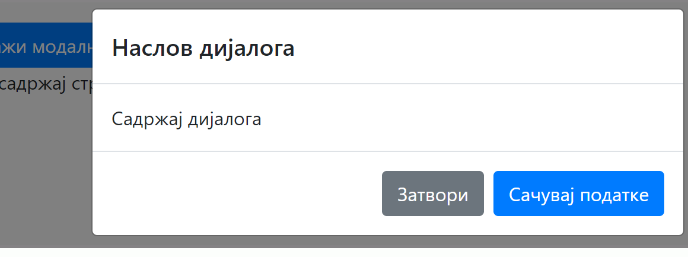

Модални дијалози
================

У лекцијама о Bootstrap стиловима смо се упознали са дијалозима који представљају компоненте које могу да прикажу неке информације. Модални дијалози се отварају када се притисне дугме за отварање дијалога 

и постављају се испред осталих елемената који ће бити засивљени док је дијалог отворен.

.. comment
    
    .. image:: ../../_images/js/modalni_dijalog.png

У дијалогу су често нека поља за унос података стављена у елемент ``<form>``. У дијалогу може да буде више дугмића - једно дугме у дијалогу служи само за затварање дијалога, друго (примарно) ће извршити неку акцију са подацима који су унети, а могу постојати и још нека дугмад која могу да реализују неке друге акције.

Овако изгледа структура блокова модалног дијалога:

.. code-block:: html

    

      

        

          

            <h5 class="modal-title">Наслов модалног дијалога</h5>
            <!-- Dugme "X" u gornjem desnom uglu dijaloga -->
            <button type="button" class="close" data-dismiss="modal" aria-label="Close">
              &times;
            </button>
          

          

            
Тело модалног дијалога (овде се стављају елементи за унос података).

          

          

            <button type="button" class="btn btn-secondary" data-dismiss="modal">Затвори</button>
            <button type="button" class="btn btn-primary">Сачувај промене</button>
          

        

      

    

Када правите модални дијалог полазећи од ове структуре, прилагодите кôд на следећи начин: 

- Поставите идентификатор у првом (највећем) ``
`` блоку тако да се подудара са идентификатором у ``data-target`` атрибуту дугмета које отвара дијалог;
- Упишите одговарајући наслов у блок са класом ``modal-header``;
- Попуните блок са класом ``modal-body`` својим елементима за унос података; 
- Опционо, можете да додате још неко дугме у блок са класом ``modal-footer``;

Овај дијалог је иницијално сакривен. За отварање дијалога се може користити дугме, које ће приказати дијалог када неко кликне на то дугме. *HTML* кôд за дугме може да изгледа овако:

.. code-block:: html

    <button type="button" class="btn btn-primary" data-toggle="modal" data-target="#ПримерМодалногДијалога">
      Покрени модални дијалог
    </button>

У овом дугмету треба као вредност атрибута ``data-target`` уписати идентификатор дијалога који одтварамо.

Дијалог можемо да отворимо са било ког места у *JavaScript* коду, а то се ради следећом наредбом:

.. code-block:: javascript

    $('#MojModalniDijalog').modal('show')

Функција облика ``$(CSS selektor)`` је део *JQuery* библиотеке која је укључена уз *Twitter Bootstrap* и ова функција је веома слична методи ``document.querySelector(CSS selector)``. У случају да желимо да са неког места у коду затворимо дијалог, можемо да користимо следећу наредбу:

.. code-block:: javascript

    $('#MojModalniDijalog').modal('hide')

Често је потребно имплементирати неку функцију која ће се активирати када се притисне дугме у дијалогу. Оваква функција може да буде постављена у ``onclick`` атрибуту дугмета. На пример, овако бисмо дугмету "Сачувај промене" придружили функцију ``sacuvaj``:

.. code-block:: html

    <button type="button" class="btn btn-primary" onclick="sacuvaj()">Сачувај промене</button>
    
Под претпоставком да је у тело дијалога стављено једно поље за унос текста, следећа функција може да пронађе вредност елемента ``<input>`` у дијалогу, уради нешто са том вредношћу (ми ћемо у примеру само приказати вредност помоћу функције ``alert``) и затвори дијалог:

.. code-block:: javascript

    function sacuvaj() {
        let podatak = document.querySelector('#MojModalniDijalog input').value;
        alert(podatak);
         $('#MojModalniDijalog').modal('hide')
    }

Следи комплетан *HTML* кôд примера, који можете директно да испробате:

.. activecode:: modalni_dijalog_html_tb
    :language: html
    :nocodelens:

    <!DOCTYPE html>
    <html>
    <head>
    <title>Bootstrap modal</title>
    <link rel="stylesheet" href="https://maxcdn.bootstrapcdn.com/bootstrap/4.3.1/css/bootstrap.min.css">
    
    
    
        
    </head>

    <body>
    

        <h2>Пример Bootstrap модалног дијалога</h2>

        <!-- дугме за покретање модалног дијалога -->
        <button type="button" class="btn btn-primary" data-toggle="modal" data-target="#ПримерМодалногДијалога">
          Покрени модални дијалог
        </button>

        <!-- модални дијалог -->
        

          

            

              

                <h5 class="modal-title">Наслов модалног дијалога</h5>
                <!-- Dugme "X" u gornjem desnom uglu dijaloga -->
                <button type="button" class="close" data-dismiss="modal" aria-label="Close">
                  &times;
                </button>
              

              

                
Тело модалног дијалога (овде се стављају елементи за унос података).

              

              

                <button type="button" class="btn btn-secondary" data-dismiss="modal">Затвори</button>
                <button type="button" class="btn btn-primary">Сачувај промене</button>
              

            

          

        

    

    </body>
    </html>

.. comment 

    https://getbootstrap.com/docs/4.3/components/modal/
