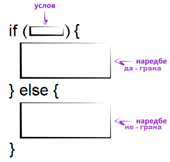
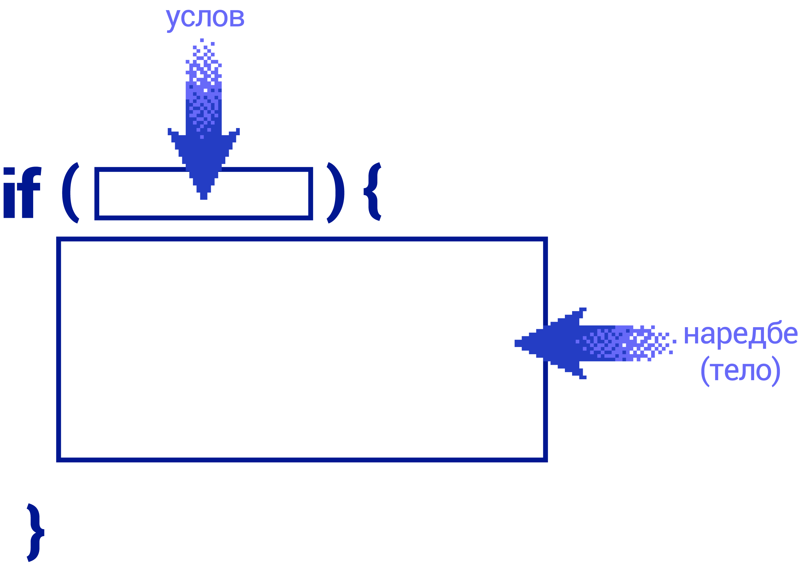

Гранања
=======

У програмима је често потребно да се у различитим ситуацијама различито поступи. Такво понашање програма остварујемо помоћу наредбе *if*. Основни облик наредбе *if* у Јаваскрипту изгледа овако:

.. code-block:: javascript

    if (услов) 
    { 
        наредбе1 
    }
    else 
    { 
        наредбе2 
    }

У овом запису реч *услов* представља било који логички израз, дакле израз чија је вредност логичког типа (тачно или нетачно). Реч *наредбе1* представља било који низ наредби које ће бити извршене ако *услов* има вредност *true*. Слично томе, реч *наредбе2* представља било који низ наредби које ће бити извршене ако *услов* има вредност *false*. Низ наредби *наредбе1* чине такозвану „да“ грану *if* наредбе, а *наредбе2* чине њену „не“ грану.

У случају да се неки од ова два низа наредби састоји од само једне наредбе, витичасте заграде око њега могу (а не морају) да се изоставе. Обле заграде које окружују услов су обавезне и не могу да се изоставе.

Скраћени облик наредбе не садржи „не“ грану, то јест изгледа овако:

.. code-block:: javascript

    if (услов)
    {
        наредбе
    }

Уколико је у скраћеном облику *if* наредбе услов испуњен, извршиће се наредбе у сада јединој грани, коју и даље можемо звати „да“ грана, а понекад је зовемо и тело *if* наредбе. Када услов није испуњен, *if* наредба нема ефекта (програм наставља са радом као да *if* наредбе није ни било).

Надовезивањем више *if* наредби може се добити такозвана вишеструка *if* наредба. На пример, надовезивањем 3 *if* наредбе добијамо запис овог облика:

.. code-block:: javascript

    if (услов1)
    { 
        наредбе1
    }
    else if (услов2)
    { 
        наредбе2
    }
    else if (услов3)
    { 
        наредбе3
    }
    else
    { 
        наредбе0
    }

Од 4 блока наредби биће извршен тачно један, и то онај који одговара првом испуњеном услову, а ако ни један од услова није испуњен, извршава се последњи блок наредби (овде означен са *наредбе0*).

У случају уметања *if* наредби једних у друге, свака реч *else* се упарује са најближом претходном речи *if*. На пример, ако у кôду...

.. code-block:: javascript

    if (услов1)
        if (услов2) наредбе1;
    else наредбе2;

...*услов1* има вредност *false*, неће бити извршене ни *наредбе1* ни *наредбе2*, јер реч *else* чини пар са другим *if*. Другим речима, претходни кôд је потпуно равноправан са следећим, који је само написан читљивије:

.. code-block:: javascript

    if (услов1) 
    {
        if (услов2) наредбе1;
        else наредбе2;
    }

Примери
-------

.. questionnote::
    
    **Пример – Тест**
    
    За полагање теста познавања саобраћајних прописа дозвољено је имати највише 3 негативна поена. Написати програм који учитава број негативних поена за сваког од четворо људи који су полагали тест и исписује број оних који су положили.
    
Задатак можемо да решимо увођењем једне бројачке променљиве (то је променљива *brUspesnih*), а помоћу ње ћемо пребројати колико кандидата је положило тест.

.. petlja-editor:: pspTest_skracena_if_naredba_js

    main.js
    let poeni = 0, brUspesnih = 0;

    poeni = parseInt(prompt('Негативни поени првог кандидата: '));
    if (poeni <= 3)
        brUspesnih++;

    poeni = parseInt(prompt('Негативни поени другог кандидата: '));
    if (poeni <= 3)
        brUspesnih++;

    poeni = parseInt(prompt('Негативни поени трећег кандидата: '));
    if (poeni <= 3)
        brUspesnih++;

    poeni = parseInt(prompt('Негативни поени четвртог кандидата: '));
    if (poeni <= 3)
        brUspesnih++;

    alert(`Тест је положило ${brUspesnih} кандидата.`);
    ~~~
    index.html
    <!DOCTYPE html>
    <html>
      <head>
        
      </head>
      <body>
        
Садржај стране (који није обавезан).

      </body>
    </html>

.. questionnote::

    **Вежба**

    Измените претходни пример тако да поред броја успешних кандидата, изброји и број кандидата који немају негативне поене (број негативних је нула).

~~~~

.. questionnote::
    
    **Пример – Викенд или радни дан:**
    
    После извршавања наредби...
    
    .. code-block:: javascript

        const sada = new Date();
        const dan = sada.getDay();
        
    ...у променљивој *dan* се налази редни број дана у недељи (0 за недељу, 1 за понедељак, ... и 6 за суботу).
    
    Написати програм који исписује „Данас је викенд.“ ако је данас субота или недеља, а иначе исписује: „Данас је радни дан.“
    
У наставку је дат програм који решава задатак:
    
.. petlja-editor:: puna_if_naredba_js

    main.js
    const sada = new Date();
    const dan = sada.getDay();
    if (dan == 0 || dan == 6)
        alert("Данас је викенд.");
    else
        alert("Данас је радни дан.");
    ~~~
    index.html
    <!DOCTYPE html>
    <html>
      <head>
        
      </head>
      <body>
        
Садржај стране (који није обавезан).

      </body>
    </html>

.. questionnote::

    **Вежба**

    Измените претходни пример тако да само за случај да је тренутни дан среда испише „Данас је дан за сладолед.“

~~~~

.. questionnote::
    
    **Пример – Поздрав:**
    
    После извршавања наредби...
    
    .. code-block:: javascript

        let sada = new Date();
        let sati = sada.getHours();
        
    ...у променљивој *sati* се налази број пуних сати у овом тренутку (број од 0 до 23).
    
    Написати програм који исписује поздрав који одговара добу дана.

    - ако је мање од 10 сати, поздрав је „Добро јутро!“
    - ако је 10 или више сати, али мање од 18 сати, поздрав је „Добар дан!“
    - ако је 18 или више сати, поздрав је „Добро вече!“

Следи програм који решава задатак:

.. petlja-editor:: produzena_if_naredba_js

    main.js
    const sada = new Date();
    const sati = sada.getHours();
    let pozdrav;
    if (sati < 10)
        pozdrav = "Добро јутро!"
    else if (sati < 18)
        pozdrav = "Добар дан!"
    else
        pozdrav = "Добро вече!"
    alert(pozdrav);
    ~~~
    index.html
    <!DOCTYPE html>
    <html>
      <head>
        
      </head>
      <body>
        
Садржај стране (који није обавезан).

      </body>
    </html>

.. questionnote::

    **Вежба**

    Измените претходни програм тако да поздрав буде „Лаку ноћ“ у случају да је време између 23 и 5 часова.

~~~~

.. questionnote::
    
    **Пример – Лепо време:**
    
    Написати програм који редом учитава највише дневне температуре у Београду, Новом Саду и Нишу, а исписује име и температуру у првом граду по редоследу  података у коме је температура била између 20 и 27 степени (укључујући и границе). Ако ни у једном од ова три града температура није била у датом интервалу, програм треба да испише да није било лепог времена.

Један од начина да решимо овај задатак је дат следећим прoграмом:

.. petlja-editor:: skracene_if_naredbe_lepo_vreme_js

    main.js
    let biloLepoVreme = false;

    const tempBeograd = parseInt(prompt('Температура у Београду: '));
    const tempNoviSad = parseInt(prompt('Температура у Новим Саду: '));
    const tempNis = parseInt(prompt('Температура у Нишу: '));
    let odgovor = '';

    if (tempBeograd >= 20 && tempBeograd <= 27)
    {
        odgovor = `Београд: ${tempBeograd}`;
        biloLepoVreme = true;
    }
    else if (tempNoviSad >= 20 && tempNoviSad <= 27)
    {
        odgovor = `Нови Сад: ${tempNoviSad}`;
        biloLepoVreme = true;
    }
    else if (tempNis >= 20 && tempNis <= 27)
    {
        odgovor = `Ниш: ${tempNis}`;
        biloLepoVreme = true;
    }

    if (!biloLepoVreme)
        odgovor = "Није било лепо време.";
        
    alert(odgovor);
    ~~~
    index.html
    <!DOCTYPE html>
    <html>
      <head>
        
      </head>
      <body>
        
Садржај стране (који није обавезан).

      </body>
    </html>

.. questionnote::

    **Вежба**

    Измените претходни програм да пронађе најнижу температуру и испише температуру и име града. Уколико два града имају исту температуру, није битно који ће бити исписан.

~~~~

.. questionnote::
    
    **Пример – Старији ученик:**
    
    У прва два реда програма дата су два објекта са подацима о ученицима (име, број телефона, разред).
    
    .. code-block:: javascript

        let ucenik1 = { ime: "Петар Петровић", tel: "012 345 678", razr: 6 };
        let ucenik2 = { ime: "Марко Марковић", tel: "098 765 432", razr: 4 };

    Допунити програм, тако да исписује који је од ова два ученика старији (тј. који иде у старији разред). 
    
Преписаћемо два дата објекта и упоредићемо поља у којима су уписани разреди. Ако је разред првог ученика већи, он је старији и приказаћемо његово име. У супротном, проверавамо да ли је други ученик старији и ако јесте, приказујемо његово име. Ако ни тај услов није испуњен, исписујемо да су та два ученика вршњаци.

.. petlja-editor:: stariji_ucenik_js

    main.js
    let ucenik1 = { ime: "Петар Петровић", tel: "012 345 678", razr: 6 };
    let ucenik2 = { ime: "Марко Марковић", tel: "098 765 432", razr: 4 };
    
    if (ucenik1.razr > ucenik2.razr) {
        alert(`Ученик ${ucenik1.ime} је старији`)
    } else if (ucenik1.razr < ucenik2.razr) {
        alert(`Ученик ${ucenik2.ime} је старији`)
    } else {
        alert(`Ученици ${ucenik1.ime} и ${ucenik2.ime} су вршњаци`)
    }
    ~~~
    index.html
    <!DOCTYPE html>
    <html>
      <head>
        
      </head>
      <body>
        
Садржај стране (који није обавезан).

      </body>
    </html>

Испробајте решење за разне вредности разреда ученика у прва два реда програма.

.. questionnote::

    **Вежба**

    Измените претходни пример тако да имамо трећег ученика:

    .. code-block:: javascript

        let ucenik3 = { ime: "Сима Симоновић", tel: "054 321 987", razr: 7 };

~~~~

.. questionnote::

    **Пример – Честитка и коверта**
    
    Написати програм који прихвата димензије честитке и коверте, а затим исписује да ли честитка може да стане у коверту. 
    
    Подразумева се да странице честитке у коверти треба да буду паралелне страницама коверте.
    
    .. image:: ../../_images/js/Koverta-Pravila.png
        :width: 500px
        :align: center

.. comment

    Dimenzije koverti:
    
    Ameriken    230 x 110 mm
    B5          250 x 175 mm
    C4          330 x 230 mm
    C5          229 x 162 mm
    B4          353 x 250 mm
    E4          400 x 280 mm
    A5+         230 x 160 mm
    B5+         260 x 190 mm
    A4+         330 x 230 mm
    B4+         360 x 260 mm

Честитка може да стане у коверту на два начина, као што показује слика. Та два начина можемо да сведемо на један, ако обезбедимо да је и код честитке и код коверте прва димензија мања а друга већа (или су једнаке). Након тога је довољно проверити да ли је прва димензија честитке мања од прве димензије коверте и друга димензија честитке мања од друге димензије коверте. Наиме, уколико честитка не може да стане у коверту на тај начин, неће моги ни на преостали начин (зашто?).

Функцја *poRedu* прихвата два параметра и враћа их редом по величини (први резултат једнак је мањем од два параметра, а други већем).

.. petlja-editor:: koverta_i_cestitka_js

    main.js
    // Враћа низ са 2 елемента тако да први елемент буде мањи од другог.
    function poRedu(a, b) {
        if (a > b) return [b, a];

        return [a, b];
    }

    let cestitka_a = parseInt(prompt(`Ширина честитке:`));
    let cestitka_b = parseInt(prompt(`Дужина честитке:`));
    let koverta_a = parseInt(prompt(`Ширина коверте:`));
    let koverta_b = parseInt(prompt(`Дужина коверте:`));

    [cestitka_a, cestitka_b] = poRedu(cestitka_a, cestitka_b);
    [koverta_a, koverta_b] = poRedu(koverta_a, koverta_b);

    if (cestitka_a < koverta_a && cestitka_b < koverta_b) {
        alert('Честитка може да стане у коверту');
    } else {
        alert('Честитка не може да стане у коверту');
    }
    ~~~
    index.html
    <!DOCTYPE html>
    <html>
      <head>
        
      </head>
      <body>
        
Садржај стране (који није обавезан).

      </body>
    </html>

.. comment

    //let n = parseInt(prompt('Унесите природан број '));
    //let izvestaj = `Број ${n}`;
    //let deljivNecim = false;
    //if (n % 2 == 0) {
    //    izvestaj += ` је дељив са 2.`;
    //    deljivNecim = true;
    //}
    //if (n % 3 == 0 && !deljivNecim) {
    //    izvestaj += ` је дељив са 3.`;
    //    deljivNecim = true;
    //}
    //if (!deljivNecim)
    //    izvestaj += ` није дељив ни са 2 ни са 3.`;
    //
    //alert(izvestaj);

.. comment

    if_naredba.png
