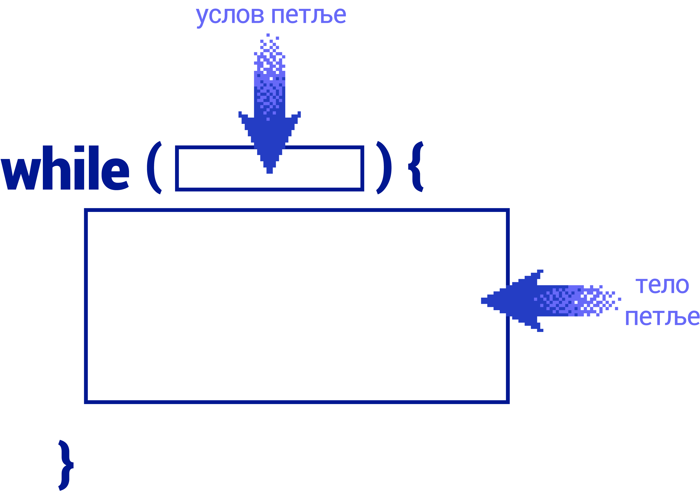

Петље у Јаваскрипту
===================

Петље су наредбе које омогућавају понављање других наредби. То значи да су петље сложене наредбе, које у себи могу да садрже друге наредбе. Свако понављање тих наредби садржаних у петљи називамо итерацијом. Уместо речи петља често се користи и реч циклус (у програмирању су ове речи синоними). 

У језику *JavaScript* постоји више врста петљи, а сада ћемо упознати неке од њих.

While петља
-----------

Општи облик *while* наредбе је:

.. code-block:: javascript

    while (услов) {
        тело
    }

Ова наредба дословно значи: „Док је испуњен услов, извршавај тело.“ Овде *услов* представља било какав израз логичког типа, дакле нешто што је тачно или нетачно (има вредност *true* или *false*), а *тело* представља једну или више било којих наредби језика *JavaScript*. Ако је у телу петље само једна наредба, витичасте заграде могу да се изоставе, али је уобичајена пракса да се не изостављају.

Наредба понављања *while* је веома слична наредби *if*. Разлика је у томе што у наредби *while* понављамо наредбе док је услов испуњен, а у *if* наредби извршимо те наредбе само једном ако је услов испуњен.

.. questionnote::

    **Пример – Збир непарних двоцифрених бројева**
    
    Написати програм који прихвата цео број и израчунава збир свих непарних двоцифрених бројева до задатог броја. 
    
Ево како задатак можемо да решимо уз помоћ петље *while*:

.. petlja-editor:: zbir_dvocifrenih_neparnih_while_js

    main.js
    let broj = 11;
    let zbir = 0;
    let granica = parseInt(prompt(`Унесите границу`));
    granica = Math.min(granica, 99);
    while (broj <= granica) {
        zbir += broj;
        broj += 2;
    }
    alert (`Збир двоцифрених непарних бројева до ${granica} је ${zbir}`);
    ~~~
    index.html
    <!DOCTYPE html>
    <html>
      <head>
        
      </head>
      <body>
        
Садржај стране (који није обавезан).

      </body>
    </html>

Прво смо поставили почетне вредности за први непаран двоцифрени број (11) и збир (на почетку је нула). Пошто се унесе број који представља границу, у *while* петљи се пре сваког додавања броја на збир проверава да ли је непаран број и даље мањи од границе. Ако јесте, настављамо да извршавамо наредбе између витичастих заграда – тренутни непаран број се додаје на збир, а сам број повећавамо за два.

For петља
---------

Општи облик петље `for` је:

.. code-block:: javascript

    for (иницијализација; услов; корак) {
        тело
    }

Овако написана *for* наредба ради исто што и:

.. code-block:: javascript

    иницијализација
    while(услов)
    {
        тело
        корак
    }

Значи, прво се извршава наредба коју смо овде назвали *иницијализација*, затим се проверава услов и докле год је он испуњен, понављају се тело петље и наредба коју смо назвали *корак*. Према томе, претходни задатак можемо да решимо и овако:

.. petlja-editor:: zbir_dvocifrenih_neparnih_for_js

    main.js
    let zbir = 0;
    let granica = parseInt(prompt(`Унесите границу`));
    granica = Math.min(granica, 99);
    for (let broj = 11; broj <= granica; broj = broj + 2) {
        zbir = zbir + broj;
    }
    alert (`Збир двоцифрених непарних бројева до ${granica} је ${zbir}`);
    ~~~
    index.html
    <!DOCTYPE html>
    <html>
      <head>
        
      </head>
      <body>
        
Садржај стране (који није обавезан).

      </body>
    </html>

Овај облик петље *for* је постао уобичајен и постоји већ дуго у разним програмским језицима, на пример *C*, *C++*, *C#*, *Java* и другим. У језику *JavaScript* поред облика петље *for* који смо управо упознали, постоје и посебни облици петље *for*, који служе за извршавање одређених наредби над сваким елементом сложене променљиве.

Посебни облици петље *for*
--------------------------

За итерирање кроз елементе низа користи се петља ``for-of``, која има овај облик:

.. code-block:: javascript

    for (променљива of низ) {
        наредбе
    }

Овде *променљива* узима редом вредности елемената низа, а *наредбе* се извршавају по једном за сваку од тих вредности. Ово је илустровано у следећих неколико једноставних примера:

.. petlja-editor:: for_of_niz_brojeva_js

    main.js
    let brojevi = [2, 5, 3];
    let zbir = 0;
    for (let broj of brojevi) {
        zbir += broj;
    }
    alert(`Збир је ${zbir}.`)
    ~~~
    index.html
    <!DOCTYPE html>
    <html>
      <head>
        
      </head>
      <body>
        
Садржај стране (који није обавезан).

      </body>
    </html>

.. petlja-editor:: for_of_niz_imena_js

    main.js
    let imena = ['Јован', 'Марко', 'Лука'];
    for (let ime of imena) {
        alert(ime);
    }
    ~~~
    index.html
    <!DOCTYPE html>
    <html>
      <head>
        
      </head>
      <body>
        
Садржај стране (који није обавезан).

      </body>
    </html>

.. petlja-editor:: for_of_string_js

    main.js
    let tekst = 'JavaScript';
    for (let slovo of tekst) {
        alert(slovo);
    }
    ~~~
    index.html
    <!DOCTYPE html>
    <html>
      <head>
        
      </head>
      <body>
        
Садржај стране (који није обавезан).

      </body>
    </html>

За итерирање кроз поља објекта користи се петља ``for-in``, која има овај облик:

.. code-block:: javascript

    for (променљива in објекат) {
        наредбе
    }

Овде *променљива* узима као вредности редом називе поља објекта, а *наредбе* се извршавају по једном за свако од тих поља. Ево како то изгледа на примеру:

.. petlja-editor:: for_in_object_js

    main.js
    let ucenik = {ime: "Петар", prezime: "Јовановић", god_rodj: 2003};
    for (let polje in ucenik) {
        alert(`${polje}: ${ucenik[polje]}`);
    }
    ~~~
    index.html
    <!DOCTYPE html>
    <html>
      <head>
        
      </head>
      <body>
        
Садржај стране (који није обавезан).

      </body>
    </html>
